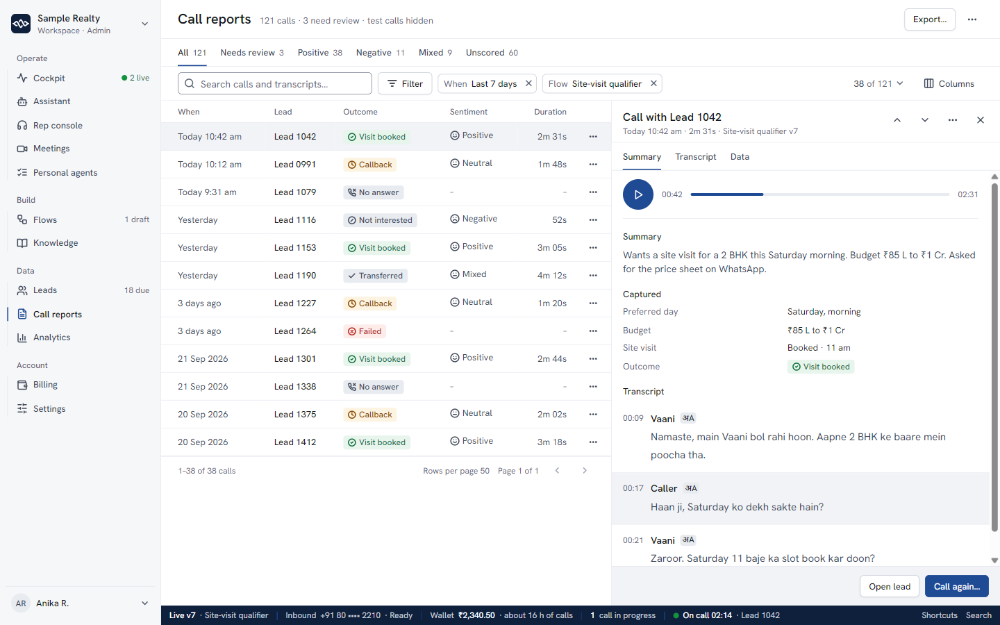

<!-- Assembled from 05-responsive.part1.md, 05-responsive.part2.md, 05-responsive.part3.md, 05-responsive.part4.md, 05-responsive.part5.md, 05-responsive.part6.md, 05-responsive.part7.md, 05-responsive.part8.md, 05-responsive.part9.md, 05-responsive.part10.md, 05-responsive.part11.md. The part files are canonical: edit them, then run spec/_tools/reassemble.py. -->

# 05 · Responsive strategy: every page at every width (Sutradhar)

<!-- Assembled from 05-responsive.part1.md … part11.md. Edit the parts, then re-assemble. -->

**Status:** v1 for build · **Date:** 2026-09-27 · **Follows:** `spec/00-design-direction.md` (D), `spec/01-foundations.md` (F) and `spec/tokens/tokens.css`, the component specs `02-components-core.md` (C), `02-components-data-nav.md` (N), `02-components-overlay-feedback.md` (O), and the page specs in `spec/03-pages/` (shell `00`, Cockpit and Rep console `01`, Assistant `02`, Leads `03`, Call reports and Analytics `04`, Knowledge and Billing `05`, Settings `06`, Meetings and Personal agents `07`, public site and auth `08`), and the Flow Designer specs `spec/04-flow-designer/01-canvas-and-nodes.md` (FD1: layouts and wireframes per breakpoint, §3 and §17) and `02-config-validation-lifecycle.md` (FD2: gate, test, history and Outline per breakpoint, §21). §10 here owns the Flow Designer's **one capability matrix** (§10.6) and its mode rules; FD1 and FD2 point to it and do not restate it.
**Evidence:** finding ids (F-RWD-…, F-UX-…, F-FLOW-…, F-A11Y-…, F-VIS-…) refer to `audit/consolidated/`. Every one of the 19 F-RWD findings is traced in §18.

**What this document owns.** The cross-page rules that decide how a layout changes with width, height and input: mode resolution, the page archetypes, the component adaptation table, touch targets, safe areas, the on-screen keyboard, orientation and zoom, and the two surfaces whose small-screen behaviour is a product decision rather than a layout one: the **Flow Designer** (§10) and the **Cockpit on phones** (§11). Where a component or page spec already fixes a value, this document points to it and does not restate it; where it changes one, §20 lists the change.

| Deliverable | Path |
|---|---|
| This spec (assembled) | `spec/05-responsive.md`, from `05-responsive.part1.md` … `part11.md` |
| Responsive reference: shell and a data page (Call reports), genuinely responsive (resize the window; `?sheet=1` opens the call sheet, `?more=1` the phone More sheet) | `spec/05-responsive-shell.html` → `05-responsive-shell-1440.png` (sidebar, docked 560 sheet, Baseline), `-1024.png` (rail, overlay sheet), `-768.png` (TopBar, P1 table, Filter with count), `-390.png`, `-390-scrolled.png` (header scrolled away, search sticky), `-390-sheet.png` (full-screen sheet), `-390-more.png` |
| Responsive reference: Flow Designer in its four modes (`?step=1` opens the step sheet, `?theme=dark`) | `spec/05-responsive-flow.html` → `05-responsive-flow-1440.png`, `-1440-dark.png`, `-1024.png` (inspector overlay), `-768.png` (tablet Review mode: Outline + read-only canvas), `-768-step.png` (read-only step sheet, selection panned into view), `-390.png` (phone Outline), `-390-step.png` (read-only step sheet) |

Both mocks link `tokens/tokens.css` and `tokens/base.css` and use media queries only (no device frames), so the same file shows every breakpoint. They implement the width classes; the height classes (§2.2) are specified here but not built into the mocks. Measured on the mocks: no sideways scroll at 320–1440; Publish fully visible at 320, 360, 390, 412, 768, 800, 834, 1024, 1280 and 1440; 9 ListRows fully visible at 360×780 once the header scrolls away; no text under 12 px on screen in any Flow Designer mode.

---

## 0. The responsive contract (one screen)

1. **Every page is designed four times, not shrunk once** (D P6): Desktop ≥1440, Laptop 1024–1439 (split at 1280), Tablet 768–1023, Phone 320–767. The layout is chosen by **width and height**; the interaction details by **pointer**.
2. **Nothing is removed at a breakpoint without a replacement** (F-RWD-001, F-RWD-002, F-RWD-011): a hidden column becomes a line in a list row, a hidden panel becomes a tab, a disclosure or a sheet, a hidden action moves into `⋯`. `hidden md:*` with nothing in its place is banned by lint (§17.3).
3. **12 of 12 destinations at every size**, including 320×640, 844×390 and 200% zoom (F-RWD-001, F-RWD-005).
4. **Nothing scrolls sideways** except content that is sideways by nature (a wide table at ≥768 with pinned columns, a ScrollRow of tabs or tokens with an edge fade). Every page scroller has `overflow-x: clip` and every flex child that holds text has `min-width: 0` (F-RWD-006, -007, -008, -016, -019).
5. **One scroller per page on phones.** Headers, KPIs and filters scroll away; only the TopBar, the search row and sticky action bars stay (F-RWD-004, F-RWD-015). `h-screen` shells with a small inner data window are banned below 1024.
6. **The primary action is never clipped.** It has `flex-shrink: 0` and is the last thing to fold; everything else folds into `⋯` first (F-RWD-003, F-RWD-007, F-RWD-008).
7. **Layout reacts to resize, rotation and zoom live**, never decided once at load (F-RWD-003, F-RWD-014). State (selection, open record, draft text, scroll position) survives every mode change.
8. **Touch is an input, not a width.** 44×44 hit areas and Touch density whenever `(pointer: coarse)`, at any width; 24×24 everywhere else (F-A11Y-023). Keyboard hints never render on touch (F-UX-048).
9. **Safe areas and the keyboard are part of the layout**: every fixed bar pads `env(safe-area-inset-*)`, full-height shells use `dvh`, and a focused field is never under a sticky bar (§7).
10. **Billable and live actions keep their gates at every size.** A phone never gets a shortcut around the Call gate or the Publish gate; it gets a full-screen version of it (D P3).

---

## 1. Decisions this spec settles

| # | Decision | Why (evidence) |
|---|---|---|
| R1 | Five width classes, three height classes and two pointer classes, resolved by one function (`lib/viewport.ts`, §2.4) that CSS mirrors with literal media queries. No other breakpoint may appear in app code. | F-VIS-035 found raw queries at 420, 640, 720, 760, 767, 1079 and 1080 beside Tailwind's; F-RWD-003 and F-RWD-014 show layout decided at load. |
| R2 | **Height is a layout input.** ≥768 wide but <600 tall uses the tablet shell; <480 tall uses phone page layouts inside it; ≤720 tall folds the Baseline; ≤800 tall with a fine pointer puts the sidebar in short mode (a coarse pointer keeps 44 px items and scrolls the nav, 06 §15.1). | F-RWD-005 (rail hides 3–5 items at 768–800 tall; 844×390 shows only one), F-RWD-002 (Cockpit collisions at 1024×768, 1100×700, 720×450). |
| R3 | **Zoom maps to width classes.** 200% on 1440×900 is 720×450 CSS px, so it gets the phone shell; 400% on 1280 is 320 px. No special zoom code, and nothing may disable zoom. | F-RWD-001 (720×450 reached 6 of 12 sections), WCAG 1.4.4 and 1.4.10. |
| R4 | **Phone bottom bar = Cockpit · Leads · Call reports · Flows · More** (N §1.8). Flows earns a slot because the phone Flow Designer is a real review, test, publish and roll-back tool (R6), not a dead end; Assistant, Knowledge, Billing and the rest live in More. | D §6.1; F-RWD-001 recommended 4 tabs + More; the audit's bar had Billing and Knowledge but not Flows. |
| R5 | **Flow Designer on tablet (768–1023): Review mode**, as D §6.5 and FD1 D11 decide: the Outline beside a read-only canvas, Test, Compare, History, Roll back and Publish; no step edits. Landscape tablets (≥ 1024, coarse pointer) get the full editor with 44 px sockets, tap-to-connect and a Navigate / Arrange switch. | §10.2. Editing needs the graph and the step at once, which portrait tablets can't show; tablet editing is a v1.1 candidate measured by `review_edit_attempt`. An earlier draft of this spec let tablets edit; that is withdrawn so every spec and render tells one story. |
| R6 | **Flow Designer on phone (< 768, or < 480 tall): the Outline, read-only.** One layout (FD1 §3.2, §10.5 here): TopBar, chip row (Draft · Live · issues), an Outline \| Canvas switch, the Outline, a sticky **Test · Publish v8…** bar directly above the BottomBar. Problems, a text and browser-voice test, versions, Publish and Roll back work; no edits. | §10.2. Phone jobs are triage; wording and branch changes need the path in view and still go through the Publish gate. |
| R7 | **Cockpit on phone keeps flow, contact, call kind and state visible at all times**, uses a sticky action bar, requests a screen wake lock during a call, and says that phone calls continue if the page is left. | F-RWD-002 (flow and customer context vanish below 768/1024), §11. |
| R8 | **Record and detail panels:** docked beside the list at ≥1440, non-modal overlay at 1024–1439, modal full-height sheet at 768–1023, full-screen sheet with a Back link below 768 (O §1.7). The phone bottom bar hides while a full-screen sheet is open. | F-RWD-004 (details opened inside a 255 px strip), F-A11Y-005, RESPONSIVE-B-20. |
| R9 | **Tables become two-line list rows below 768**, never a squeezed table; at 768–1023 they show P1 columns plus pinned key and actions. There is no per-row call button on phones. | F-RWD-010, F-RWD-011, F-RWD-016; N §7.13. |
| R10 | **The wallet banner is retired at every width.** Wallet state lives in the Baseline (≥1024), the TopBar chip (<1024) and inline on blocked call actions. | F-RWD-013, F-UX-028. |
| R11 | **No orientation lock and no "rotate your device" screens.** Every page works in both orientations; landscape phones get the tablet shell with phone page layouts. | WCAG 1.3.4; F-RWD-005 (844×390). |
| R12 | **Real-device sign-off is part of done** for touch pan and pinch on the canvas, iOS focus zoom, safe-area overlap and the on-screen keyboard, which the audit could only emulate. | 00-summary §6; F-RWD-014. |

---

## 2. Breakpoints, height and input: how a layout is chosen

### 2.1 Width classes

The five min-width breakpoints are F §5 (`--bp-sm` 480 · `--bp-md` 768 · `--bp-lg` 1024 · `--bp-xl` 1280 · `--bp-2xl` 1440). The brief's four ranges map onto them like this:

| Brief range | Class (N §0.3 shorthand) | Width | Shell | Designed for |
|---|---|---|---|---|
| Desktop 1440+ | Desktop | ≥1440 | Sidebar 232, docked sheets and inspector | 1440×900, 1536×864, 1920×1080 |
| Laptop 1024–1440 | Laptop-L | 1280–1439 | Sidebar 232, overlay sheets | 1280×800, 1366×768 (the common Indian office laptop, F-UX-007) |
| | Laptop-S | 1024–1279 | Rail 56 + overlay sidebar | 1024×768 windows, 1280×1024 monitors, iPad landscape 1024–1194 (a 1280×720 screen at 125 % is only about 1024×465 inside the browser, so it gets the tablet shell by height, §2.2) |
| Tablet 768–1024 | Tablet | 768–1023 | TopBar 52 + NavSheet | iPad portrait 768 / 810 / 820 / 834 (the F-RWD-003 range), 200% zoom of a 1920×1080 screen (about 960×485 inside the browser) |
| Mobile 320–768 | Phone | 320–767 (`sm` 480 splits large phones) | TopBar 52 + BottomBar 56 + More | 360×780, 375×667, 390×844, 412×915, 320×640 |

**Screen size is not viewport size.** The "Designed for" column lists device screens. Layout, budgets and tests use the **inner viewport** (`innerWidth × innerHeight`, which is what Playwright's `viewport` sets): the screen minus the OS taskbar or menu bar and the browser's tab strip and toolbar. The reference inner sizes, measured for maximised Chrome and Edge with no bookmarks bar, are listed below. Every budget in this spec set (D §6.1, shell `00` §3.5, Leads `03` §5.0, §3.4 here) is computed at these sizes, and §17.1 tests at them.

| Screen | Where it is common | Inner viewport (reference) | Width, height class |
|---|---|---|---|
| 1920×1080 | desktops, 15.6″ laptops at 100 % | **1920×969** | Desktop, normal |
| 1536×864 | 1920×1080 laptops at 125 % Windows scaling | **1536×730** | Desktop, short |
| 1440×900 | 13″ MacBook (Chrome, Dock hidden) | **1440×789** (the mocks render at 1440×900, the "tall desktop" case) | Desktop, short |
| 1366×768 | the common Indian office laptop (F-UX-007) | **1366×657** (about 1366×625 with a bookmarks bar) | Laptop-L, short **and compact** |
| 1280×720 | small laptops, 1600×900 at 125 % | **1280×609** | Laptop-L, short and compact |
| 1024×768 (iPad landscape) | tablets with Safari's tab bar | **1024×~690**, Touch density | Laptop-S, compact; coarse pointer, so no short nav mode (44 px rail items, the rail scrolls) |
| 768×1024 (iPad portrait) | Safari | **768×~950** | Tablet |
| 390×844 · 360×800 | iPhone 13–15 Safari · mid-range Android Chrome | **390×664** with Safari's toolbar, **390×750** once it collapses · **360×780** with the URL bar scrolled away | Phone |
| 844×390 | the same iPhone in landscape | **844×340** | Tablet shell (landscape phone), tiny |

So on a 1366×768 laptop the Compact height class (§2.2) always applies: the Baseline is folded into its **BaselineChip**, which is the primary workspace-status surface on that device and is tested there (§17.5).

Media queries use literal values with a `.98` upper bound (`@media (max-width: 767.98px)`), matching `tokens.css`. Tailwind utilities use the `sm md lg xl 2xl` keys that map to these values (F §15); arbitrary breakpoints such as `min-[1100px]:` are banned in app and marketing code alike (the public header fits at 1024 because its link set is five short links, `08` §4.1).

### 2.2 Height classes

| Class | Query | Effect | Evidence |
|---|---|---|---|
| **Short** | `(min-width: 1024px) and (max-height: 800px) and (pointer: fine)` | Sidebar and rail short mode: 28 px items, setup card as one row; all 12 items fit in 596 px (N §1.2). Never on a coarse pointer: landscape tablets keep 44 px items and the nav list scrolls, because touch targets never shrink to fit (06 §15.1) | F-RWD-005, F-A11Y-023 |
| **Compact** | `(max-height: 720px)` | `--size-baseline: 0`; the Baseline folds into the BaselineChip; ViewTabs fold into a "View" select. Applies on every 1366×768 and 1280×720 laptop (inner 657 and 609 tall), so the BaselineChip, not the band, is what most office users see; the band shows from 1536×864 (730 tall) up. The fold stays at 720 rather than a lower, Baseline-only fold: below 600 px tall the tablet shell takes over anyway and its TopBar chips carry the same facts, so a lower fold would never fire and would only make every short laptop pay 28 px of rows (11 instead of 12 at 1366×657) | D §6.1, F §5 |
| **Landscape phone** | `(min-width: 768px) and (max-height: 599.98px)` | Tablet shell whatever the width | shell `00` §3.4 |
| **Tiny** | `(max-height: 479.98px)` | Phone page layouts inside the tablet shell: page header rows hide into the TopBar, summaries hide, pagers scroll with the list | Leads `03` §5.6; 844×390 showed no lead rows (F-RWD-011) |

### 2.3 Input classes

| Query | Meaning | What changes |
|---|---|---|
| `(pointer: coarse)` | the primary pointer is a finger | Touch density (44 px controls, 48 px rows, 16 px field text), no short nav mode, 44 px answer and result rows on the canvas so each socket's target is the 44 × 44 row end (FD1 §6.1), the Navigate / Arrange switch in the Flow Designer at ≥ 1024, no hover reveals |
| `(hover: hover) and (pointer: fine)` | mouse or trackpad | hover fills, hover-revealed row actions, tooltips on hover, keycap hints |
| `(any-pointer: coarse)` with a fine primary | touch laptop | keep fine-pointer density, but hover-revealed actions stay visible on focus and on the selected row, so a tap can reach them |

Rules: never detect devices by user agent; never make a layout decision from `pointer` alone (a mouse on a 820 px tablet is still a tablet layout). Hover styles are wrapped in `@media (hover: hover)` so a tap never leaves a sticky hover fill.

### 2.4 One resolver, live

```ts
// lib/viewport.ts — mirrors the CSS; used only where JS must know (React Flow, sheets, focus)
export type ShellMode = 'sidebar' | 'rail' | 'topbar' | 'bottombar';
export type FlowMode  = 'full' | 'compact' | 'review' | 'phone';   // §10.2
export function shellMode(w: number, h: number): ShellMode {
  if (w < 768) return 'bottombar';          // phones, 200% zoom of 1440×900
  if (w < 1024 || h < 600) return 'topbar'; // tablets, landscape phones
  return w < 1280 ? 'rail' : 'sidebar';
}
export function flowMode(w: number, h: number): FlowMode {
  if (w < 768 || h < 480) return 'phone';
  if (w < 1024) return 'review';            // tablets: Review mode, no step edits
  return w < 1280 ? 'compact' : 'full';
}
// FlowCanvas `mode` (FD1 §20.1): 'edit' for full and compact, 'review' for review and phone.
export const coarse = () => matchMedia('(pointer: coarse)').matches;
```

- `useViewport()` subscribes to `matchMedia` change events for each boundary (not a throttled `resize` loop) and to `visualViewport` for the keyboard (§7.3). It returns `{ shell, flow, coarse, short, compact, tiny, keyboardOpen }`; `short` mirrors the Short query including its `(pointer: fine)` clause (§2.2), so it is never true on a touch tablet.
- **CSS decides layout; JS only follows.** Server render emits every variant's CSS, so there is no hydration flash; JS uses the resolver for things CSS cannot do (React Flow `fitView`, choosing a sheet's modality, moving focus).
- **Mode changes are non-destructive:** the open record, the selected step, the draft text in a field, the active tab and the scroll anchor are kept. A sheet that changes modality (overlay at 1100 → modal at 900 after a resize) re-mounts in place with focus kept on the same control.

### 2.5 Container queries

Panels whose width depends on their parent, not the viewport, use `@container` (F §5, F-VIS-035): the Flow inspector and step sheet, the Cockpit call card and New call card, every Sheet body, StatGrid, ChartFrame, the Embed preview, KeyValueList (label beside value at ≥360 px, stacked below) and the Top-up presets. Rule: a component never reads the viewport to lay out its own insides.

### 2.6 Zoom, text size and text spacing

- The root font size is the browser's (N §0.6 fixes `html { font-size: 100% }`), so a user's larger default text scales every `rem` token. Test at 125% and 150% browser text size: nothing may clip or overlap; buttons keep one-line labels by folding into `⋯`, not by wrapping.
- 200% zoom on 1440×900 resolves to the phone shell; 400% on 1280 to 320 px. Both must pass WCAG 1.4.10 with no sideways page scroll and no overlapping controls (F-RWD-002 failed exactly this at 720×450).
- Text spacing overrides (WCAG 1.4.12: line height 1.5, letter spacing 0.12 em, word spacing 0.16 em) must not clip fixed-height elements: tags, chips, the Baseline and bottom-bar labels use `min-height`, never `height`, for their text box.

---

## 3. Grid, page archetypes and the scroll model

### 3.1 Grid

Columns, gutters and margins are F §5 (`--grid-columns` 12 / 8 / 4, `--grid-gutter` 24 / 16 / 12, `--page-margin` 24 / 24 / 16) and the containers (`--size-container-page` 1280, `-form` 720, `-narrow` 400, `--size-measure` 68ch). Additions:

- On phones, full-bleed lists and tables run edge to edge; their rows carry the 16 px margin as inner padding, so tap areas reach the screen edge.
- Landscape phones and notched devices add the side insets: `padding-inline: max(var(--page-margin), env(safe-area-inset-left))` (and right) on the page container, TopBar and sticky bars.
- At ≥1920 data surfaces stay fluid; overview and form pages centre in their container, and the PageHeader aligns with that container, never with the viewport edge (F-VIS-034).

---

### 3.2 Five page archetypes

Every signed-in page is one of five archetypes. A page spec picks one and only describes its differences. Wireframes show the content region; shell chrome is §4.

**A. Data page** (Leads, Call reports, Knowledge, Flows, Meetings list, Billing › Invoices and ledger). Job: find a record and act on it.

```
Desktop ≥1440                                         Laptop 1024–1439
┌ header 56: H1 · meta ········ tertiary secondary [Primary]┐  ┌ same header; Columns icon-only <1280 ─┐
│ views 40: All 1,284 · New 312 · …                  │  │ views                                   │
│ toolbar 48: ⌕ search  Filter  [token][token] ·· 38 of … Columns Density │  │ toolbar: 2 tokens inline (<1280)       │
│ ┌ table P1–P3 ─────────────────┐┌ record sheet 440 ┐ │  │ table P1–P3 (≥1280) / P1–P2 (<1280)   │
│ │ sticky head 32               ││ docked, non-modal │ │  │        ┌ sheet overlays right third ┐ │
│ └──────────────────────────────┘└───────────────────┘ │  │        └ non-modal, no scrim ───────┘ │
│ pager 40 · BulkBar floats above it                  │  │ pager                                   │
└─────────────────────────────────────────────────────┘  └─────────────────────────────────────────┘
Tablet 768–1023                                       Phone 320–767
┌ meta ··············· ⋯ [Primary] ┐ (H1 in TopBar)   ┌ meta ····· ⋯ [New] ┐  scrolls away
│ views: scrolling row, edge fade  │                  │ ⌕ Search… (sticky)  │
│ ⌕ search ······ [Filter · 2]     │ tokens in popover │ Filter·2 tok tok →  │  ScrollRow
│ table: P1 + pinned key and ⋯,    │                  │ Title        Tag    │  ListRow 48+
│ horizontal scroll inside         │                  │ meta · meta   अ     │
│ pager                            │                  │ …                   │
│ sheet: modal, 100% height,       │                  │ pager (in flow)     │
│ min(560, 100%) wide              │                  │ sheet: full screen  │
└──────────────────────────────────┘                  └─────────────────────┘
```

**B. Overview page** (Home, Analytics, Billing › Wallet and Usage, Personal agents explainer). Job: understand a state, then take one action. Container `--size-container-page` 1280, centred.

```
Desktop / Laptop                       Tablet                         Phone
┌ header ····· [Primary] ┐            ┌ meta ··· ⋯ [Primary] ┐       ┌ meta ··· [Primary] ┐
│ [KPI][KPI][KPI][KPI]   │ 4 across   │ [KPI][KPI]           │ 2×2   │ [kpi][kpi][kp→     │ strip, snap
│ [chart     ][chart    ]│ 2 per row  │ [KPI][KPI]           │       │ [chart 160        ]│ 1 per row
│ [card      ][card     ]│            │ [chart 200          ]│ 1/row │ [card             ]│
└────────────────────────┘            └──────────────────────┘       └────────────────────┘
```

**C. Form page** (Settings pages, Billing › Autopay, Flow settings, Profile). Job: change a setting and know it saved. Column `--size-container-form` 720.

```
Desktop / Laptop                              Tablet                          Phone
┌ sub-nav 200 ┬ form column ≤720 ──────┐    ┌ ‹ Settings  Phone setup  ┐    Settings index (list) → page
│ Workspace   │ Section title          │    │ column centred, max 720  │    ┌ ‹ Settings  Phone setup ┐
│  Profile ▣  │ [field]  [field]  2-col│    │ [field]                  │    │ field (full width)      │
│ Calling …   │ [field]                │    │ [field]  (1 col <600)    │    │ field                   │
│             │ UnsavedChangesBar ────│    │ UnsavedChangesBar sticky │    │ [Discard] [Save changes]│ sticky bar
└─────────────┴────────────────────────┘    └──────────────────────────┘    └─────────────────────────┘
```

Two-column field rows exist only when both fields are short (≤ `--field-w-medium`) and the column is ≥600 px; otherwise one column. Labels sit above fields at every width (never beside them on phones).

**D. Workbench** (Cockpit, Assistant, Rep console, Flow Designer, a Meetings room). Job: do live, focused work in one place. Columns each scroll on their own at ≥1024; below 1024 the columns become panes (tabs or a segmented switch) or disclosures, never removed (F-RWD-002).

```
Desktop ≥1440                  Laptop 1024–1439            Tablet 768–1023               Phone
┌ list 240 ┬ card 400 ┬ rest ┐  ┌ card 400 ┬ rest ───┐     ┌ sticky context header ┐    ┌ sticky context ┐
│ switch   │ scrolls  │ log  │  │ list → header switch│    │ [Pane A | Pane B]     │    │ disclosure ›   │
│          │ footer ▬ │      │  │                     │    │ pane scrolls          │    │ main pane      │
└──────────┴──────────┴──────┘  └─────────────────────┘    │ sticky action bar     │    │ sticky 44 bar  │
                                                            └───────────────────────┘    └────────────────┘
```

**E. Record and detail sheets** (lead, call detail, knowledge source, webhook, task, Top up, Publish gate, step inspector). Modality and width follow O §1.7; the header (title, meta, Previous and Next, Copy link, `⋯`, Close) is identical at every width except that phones replace Close with a Back link ("‹ Call reports") at the left (O §4.6).

### 3.3 The scroll model

| Width | Model | Sticky elements (top to bottom) | Evidence |
|---|---|---|---|
| ≥1024 | The page body scrolls inside `main`; data regions (table body, transcript, canvas) may own their scroll when the archetype needs a fixed frame (Workbench, Data page table) | PageHeader, ViewTabs and toolbar with the table header on data pages; nothing else | F-RWD-012 (column header scrolled away) |
| 768–1023 | One scroller per pane; sheets full height | TopBar; the search row on data pages; the sticky action bar on workbenches | F-RWD-004 |
| <768 | **One page scroller.** Header row, summaries and KPIs scroll away | TopBar; the search row (data pages); the sticky action bar or composer; the BottomBar. At most **two** sticky bars besides the TopBar and BottomBar | F-RWD-004, F-RWD-015, RESPONSIVE-B-18 |

- `main` (or the page scroller) always has `overflow-x: clip` (not `hidden`, so sticky children keep working) as a safety net (F-RWD-006, -008, -019).
- Every scroll container that is not the page sets `overscroll-behavior: contain` so a fling inside a sheet or transcript does not scroll the page or trigger pull-to-refresh.
- Nested scrollers are allowed only for: a wide table's horizontal axis (≥768), the transcript in a Workbench at ≥768, the canvas, and a ScrollRow. A transcript or record body inside a 255 px box (F-RWD-004) or a 262 px demo box inside a page (F-RWD-018) is not allowed.
- `scroll-margin-top` on focusable content equals the height of the sticky stack above it, and `scroll-padding-bottom` equals the sticky bars below it, so focus and in-page links are never hidden (WCAG 2.4.11).

### 3.4 Chrome budget per breakpoint

Vertical chrome on a Data page in Standard density (Touch on phones and coarse-pointer tablets), with the work area that remains. **Every row is an inner viewport** (§2.1), not a screen size: an earlier version of this table subtracted chrome from 768 for a 1366×768 laptop, whose Chrome or Edge viewport is about 657 tall. Targets come from D §6.1 and shell `00` §3.5; Leads `03` §5.0 uses the same numbers (no summary band: the view's size is the toolbar count).

| Inner viewport | Screen it stands for | Chrome | Work area | Target |
|---|---|---|---|---|
| 1920×969 | 1920×1080 | header 56 + views 40 + toolbar 48 + head 32 + pager 40 + Baseline 28 = 244 | 725 → 18 rows at 40 | ≥14 rows |
| 1440×900 | the mocks' reference size | 244 | 656 → 16 rows | ≥14 rows |
| 1440×789 | 13″ MacBook | 244 (short mode, Baseline shown) | 545 → 13 rows | ≥10 rows |
| 1536×730 | 1920×1080 at 125 % | 244 (short mode, Baseline shown) | 486 → 12 rows | ≥10 rows |
| 1366×657 | **1366×768**, the reference office laptop | Compact: Baseline → BaselineChip, views → select: 56 + 48 + 32 + 40 = 176 | 481 → 12 rows | ≥10 rows |
| 1366×625 | the same with a bookmarks bar | 176 | 449 → 11 rows | ≥10 rows |
| 1280×609 | 1280×720 | 176 | 433 → 10 rows | ≥10 rows |
| 1024×690 | iPad landscape (Safari), Touch rows 48 | 176 (rail) | 514 → 10 rows at 48 | ≥8 rows |
| 768×950 | iPad portrait (Safari) | TopBar 52 + header row 48 + toolbar 48 + pager 40 = 188 | 762 → 15 rows at 48 | ≥12 rows |
| 390×750 | 390×844 iPhone, Safari toolbar collapsed | TopBar 52 + search 56 + BottomBar 56 + inset 34 = 198 while scrolled (header row and filter row scroll away) | 552 → 8 two-line rows at 62 | ≥8 rows (N §7.13) |
| 390×664 | the same, toolbar shown (no bottom inset under it) | 164 | 500 → 8 rows | ≥8 rows |
| 360×780 | 360×800 Android, Chrome's URL bar scrolled away | 164 (no home indicator on most Android) | 616 → 9 rows | ≥8 rows (F-RWD-011: 2 today) |
| 320×640 | 400 % of 1280 | 164 | 476 → 7 rows | ≥6 rows |
| 844×340 | 844×390 landscape iPhone, Safari | TopBar 52 only; header row in the TopBar (tiny class) | 288 → 4 rows | ≥4 rows (0 today, F-RWD-011) |

The mocks render phones at 390×844 and 360×780 and laptops at 1440×900; acceptance tests run at the inner sizes above (§17.1). No global banner is part of any budget (R10). A page Notice (one line, 40) is allowed when the page's main task is blocked; it scrolls away on phones.

---

## 4. Shell adaptation

The shell is fully specified in N §1 and shell `00` §3. This section fixes what **pages** must do so the shell works at every size, and restates the breakpoint behaviour in one table for traceability.

### 4.1 Shell per breakpoint (reference)

| | Desktop ≥1440 | Laptop-L 1280–1439 | Laptop-S 1024–1279 | Tablet 768–1023 | Phone 320–767 |
|---|---|---|---|---|---|
| Navigation | Sidebar 232, grouped, labelled | Sidebar 232 | Rail 56; `[` opens the sidebar as an overlay with a scrim | TopBar 52: ☰ · title · call chip · wallet chip · search; NavSheet 320 (max 85vw) | TopBar 52 + BottomBar 56 (Cockpit, Leads, Call reports, Flows, More) + MoreSheet |
| H1 | PageHeader (title-20) | PageHeader | PageHeader | TopBar title (title-16) | TopBar title |
| Workspace facts | Baseline 28 | Baseline | Baseline | TopBar chips; BaselineList in the NavSheet | TopBar chips; BaselineList in More |
| Setup track | Sidebar card | Sidebar card | Overlay only (dot on the expand button) | NavSheet | MoreSheet |
| Account, theme, sign out | Account menu | same | Avatar menu | NavSheet | MoreSheet (Sign out… last, confirmed) |
| Short height | Short mode ≤800 (fine pointer only); Baseline chip ≤720 | same | same | Tablet shell from <600 tall at any width | — |
| Flow Designer (focus mode) | Rail forced, no Baseline, Flow header 48 | same | same | Shell TopBar 52 (☰) stays; the 48 px Flow header sits under it (Review mode, §10.5) | Standard phone TopBar with a Back link; chip row; sticky Test · Publish bar; BottomBar stays |

 · `05-responsive-shell-1024.png` · `05-responsive-shell-768.png` · `05-responsive-shell-390.png`

### 4.2 What every page must do for the shell

1. **Reserve the bars.** Phone pages end with `padding-bottom: calc(var(--size-bottombar) + env(safe-area-inset-bottom) + var(--space-16))`; pages with a sticky action bar add its height. Nothing is ever hidden under the BottomBar (RESPONSIVE-B-20: the lead drawer's last 56 px were covered).
2. **Stay above or below it on purpose.** Full-screen sheets, dialogs and the MoreSheet sit at `--z-modal` above the BottomBar (`--z-chrome`) and hide it while open; toasts and the BulkBar sit above it (O §9.3, N §7.10).
3. **Hand the H1 to the TopBar below 1024.** The PageHeader keeps the meta and actions row; it never repeats the title (N §2.7).
4. **Never add chrome to the shell.** No page-specific banners in the TopBar or BottomBar; a blocking problem is a page Notice (D §6.1 blocking-notice rule).
5. **Declare its archetype and its phone slot.** `lib/nav.ts` holds `phoneSlot`; a page not in the bar marks More as current (N §1.8).
6. **Handle the keyboard.** While a text field is focused on a phone, the BottomBar hides (`keyboardOpen`, §7.3) so the field and its sticky action bar get the space.

### 4.3 Wallet and status signals per breakpoint (F-RWD-013, F-UX-028)

| | ≥1024 | 768–1023 | <768 |
|---|---|---|---|
| Healthy | Baseline segment "Wallet ₹2,340.50 · about 16 h of calls" | Wallet chip "₹2,340" (neutral) | Wallet chip "₹2,340"; hidden first if the title would drop below 120 px |
| Low or empty | Amber Baseline segment with "Top up"; a one-line WalletNotice only on spending pages (Cockpit, Leads call actions) | Amber chip "₹42 · Top up" (never hidden before the call chip); WalletNotice on spending pages | Amber chip; the WalletNotice becomes a one-line pill "Wallet ₹0 · Top up" with one CTA (no autopay), Dismiss 44×44 at least 8 px away, remembered for the session; never on /billing |
| Every Top up | Opens `/billing?topup=1` (the Top-up sheet) | same | same, full screen |

The 42–97 px banner with two wrapping buttons and a 22 px Dismiss 7 px from "Enable autopay" (F-RWD-013) does not exist at any width.

---

## 5. Component adaptation

### 5.1 The adaptation table

One row per component, by spec name. "=" means the same as the column to its left. Values not shown here are in the component's own Responsive section (cited).

| Component (spec) | Desktop ≥1440 | Laptop 1024–1439 | Tablet 768–1023 | Phone 320–767 | Findings |
|---|---|---|---|---|---|
| **PageHeader** (N §2.7) | H1 · meta · ≤3 actions, primary last | = | H1 → TopBar; meta + `⋯` + primary; secondary and tertiary fold into `⋯` | row 48: meta, `⋯`, primary (`labelShort`); meta wraps to its own line before anything clips | F-RWD-007, -008, -016 |
| **ViewTabs / RouteTabs** (N §3.7) | row | = | ScrollRow with edge fade | ScrollRow; selected tab kept in view | F-RWD-012 |
| … at ≤720 tall | "View: All ▾" select in the toolbar | = | = | = | D §6.1 |
| **FilterBar** (N §6.7) | one row, 3 tokens, "+n filters" | 2 tokens <1280; Columns icon-only | tokens fold into "Filter · 2" → Popover of tokens + Add filter | search full width, sticky; ScrollRow of Filter · tokens · Clear; pickers as bottom sheets with "Show 38 leads" | F-RWD-009, -012 |
| **SearchField** (N §6.2) | 280 flexible, min 160 | = | = | 100% width, 16 px text, placeholder ≤ 3 words ("Search calls…") | F-RWD-009 |
| **DataTable** (N §7.13) | P1–P3 + user columns | P1–P3 ≥1280, P1–P2 <1280 | P1 + user columns; pinned key/select left and actions right; horizontal scroll inside | **ListRow** list | F-RWD-010, -011, -016 |
| **Row actions** (N §7.8) | on hover and focus, `Call…` and `⋯` | = | always-visible `⋯` (coarse) | none in the row; in the record sheet footer or selection mode | F-RWD-011 |
| **BulkBar** (N §7.10) | floats above the pager | = | = | docked full width above the BottomBar | — |
| **Pager** (N §7.11) | sticky bottom of the data region | = | = | in flow at the end of the list; "1–50 of 121 · Next" 44 px | F-QA-005 |
| **StatGrid / StatTile** (N §4.8) | 4 across, sparklines | 4 across (min 200) | 2 across | compact tiles in a scroll-snap strip, no sparklines; or folded into the header meta (Leads) | F-RWD-004, -008, -011 |
| **ViewSummary** (`04` §4.1) | one line | truncates from the end | 3 facts | 2 facts in the header meta; wraps, scrolls away | F-RWD-011 |
| **ChartFrame** (N §11.10) | 240 plot, 2 per row | 240 / 200 | 200, 1 per row | 160; 3–4 x ticks; legend above, wraps; drawn 1:1 from a ResizeObserver, axis text HTML ≥12 px | F-VIS-012 |
| **Record sheet 440 / detail 560** (O §4.6) | docked beside content | overlay right, non-modal | modal, full height, min(560, 100%) | full screen, Back link, sticky footer, BottomBar hidden | F-RWD-004 |
| **Gate sheet** (Publish 640, Top up) | modal right 640 | = | modal full height | full screen, sticky primary above the safe area | D P3 |
| **Call gate popover** (O §5.4) | anchored 400 | = | anchored if it fits, else bottom sheet | bottom sheet, `Place call` sticky | F-UX-013 |
| **Dialog sm / md / lg** (O §2.6) | centred | = | centred, width min(size, 100% − 48) | sm → bottom sheet; md/lg → full screen, sticky header and footer | F-A11Y-005 |
| **ConfirmDialog** (O §3) | centred sm | = | = | bottom sheet; buttons stacked, primary on top, Cancel last above the safe area | — |
| **Popover** (O §5) | anchored | = | anchored if it fits | bottom sheet with title + Done | — |
| **Menu** (O §7.6) | anchored | = | anchored | anchored if ≤5 items and no danger item; else action sheet | F-UX-035 |
| **Tooltip** (O §6.5) | hover and focus | = | focus only on touch | never on touch; the content exists elsewhere (visible label, second line) | F-VIS-013, -014 |
| **CommandPalette** (O §8.6) | centred md | = | centred; from the TopBar search | full screen, results above the keyboard | — |
| **Toast** (O §9.3) | bottom right above the Baseline | = | bottom right | full width above the BottomBar | — |
| **Notice / WalletNotice** (O §10) | one line under the header | = | = | one-line pill, one CTA, 44 px Dismiss ≥8 px away | F-RWD-013 |
| **ConnectionBar** (O §10.3) | top of `main` | = | under the TopBar | under the TopBar; one line "Offline · data from 11:42 am" | F-QA-007 |
| **UnsavedChangesBar** (O §18.3) | sticky at the bottom of the form column | = | = | sticky action bar above the BottomBar (Discard · Save changes, 1:1) | F-UX-012 |
| **Field layout** (C §8.1) | 2 columns only for short pairs | = | 1 column below 600 px container | 1 column, labels above, 16 px text, `autocomplete` and `inputmode` set | RESPONSIVE-B-19 |
| **Select / Combobox** (C §5) | anchored listbox | = | = | bottom sheet with search and 48 px rows | — |
| **Date and time pickers** (C §7.1) | popover calendar | = | = | presets first, then native `input type="date"` / `time` (the platform picker), IST shown | — |
| **FileUpload / Dropzone** (C §7.2) | drop zone "Drop a file or choose one" | = | = on fine pointers; "Choose a file" on touch | full-width button "Choose a file", no drop copy | F-RWD-016, F-UX-048 |
| **SegmentedControl** (N §3.7) | inline | = | inline | full width when alone in its row; 44 px segments | — |
| **SettingsNav** (`06` §3) | 200 px column | = | SettingsIndex list → page, "‹ Settings" in the TopBar | same as tablet, full width | RESPONSIVE-B-13 |
| **TranscriptFeed / TurnRow** (N §12.4) | 56 px `mm:ss` gutter (`--size-turn-gutter`, `meta-12` tabular) | = | = | gutter 48; timecode above the speaker line when the container is <360 px; turns wrap, never truncate | F-UX-010 |
| **RecordingPlayer / TalkStrip** (N §12.5) | inline in the sheet | = | = | sticky at the top of the call sheet body; 44 px play, ±5 s buttons visible | F-RWD-004 |
| **Timeline** (N §10) | full | = | = | day headers sticky; "Load more" button | — |
| **KeyValueList** (N §8) | label beside value | = | = | stacked when the container is <360 px (container query) | — |
| **Kbd hints** (C §7.3) | tooltips, menus, `?` sheet | = | fine pointers only | never | F-UX-048, F-RWD-014 |
| **EmptyState / Skeleton** (O §13, §15) | inside the shell | = | = | same copy; skeleton rows match ListRow height | F-VIS-023 |
| **Canvas controls** (Flow, §10) | floating bottom-left + minimap | no minimap <1280 | in the bottom tool bar, 44 px | in the Map toolbar row | F-RWD-014 |

### 5.2 Tables → priority columns → list rows

- **Priority, not order, decides what shows** (N §7.5). Each page declares P1–P4; P1 must be enough to recognise and triage a record, because P1 forms the phone row. Examples: Leads P1 = Lead, Status, Last call; Call reports P1 = When, Lead, Outcome; Knowledge P1 = Name, Indexing status; Flows P1 = Name, Version state, Issues.
- **768–1023:** P1 plus any user-chosen columns. When wider than the container: the select and key columns pin left and the actions column pins right (`position: sticky`, background, 1 px edge while scrolled). This fixes F-RWD-016 (Embed and Delete unreachable at 768) and F-RWD-010 (values separated from their call).
- **Below 768: ListRow** (N §7.13), two lines, min 48 px: line 1 title + trailing status tag; line 2 meta (masked phone, outcome or size, relative time) + trailing language name or amount (never a bare glyph, N §5.6). Columns map through `meta.mobile` (`title`, `titleTrailing`, `meta`, `metaTrailing`, `hidden`). Hidden columns stay reachable in the record sheet.
- **Nothing is dropped without a home** (F-RWD-011, F-UX-048): Status and Interest move into the row (tag, and "Interest 72" in the meta line), Sentiment into the meta line with its word ("Negative"), Duration beside the time.
- **No per-row call button on phones.** Calling starts from the record sheet footer or selection mode, so a mis-tap never dials and the 32×32 flush call button of today goes away (F-RWD-011, F-A11Y-023).
- **Selection on phones** starts from a "Select" button in the header row, which shows 44 px leading checkboxes and the docked BulkBar; long-press is not used (§6.3).
- **Density:** Touch (48 rows) on coarse pointers; Compact is not offered on touch; the density switch is hidden.

### 5.3 Filter bars → sheets

- ≥1024: tokens inline (3, or 2 below 1280), "+n filters" popover.
- 768–1023: one "Filter · 2" button with the active count; it opens a Popover listing the active tokens and "Add filter".
- <768: row 1 is the search field at full width (sticky); row 2 is a ScrollRow (§5.8) with Filter · the tokens · Clear. Each picker opens as a bottom sheet with a footer button that states the result ("Show 38 leads", "Show all calls" when nothing narrows), so one query runs per decision. Sort lives in the same sheet on phones ("Sort by Last call, newest first").
- The Call reports sentiment pills that ran 12 px off-screen at 360 (F-RWD-009) become ViewTabs (All · Needs review · Positive · Negative · Mixed · Unscored) in a ScrollRow; the Leads Source and Status chip rows (F-RWD-012) become the Filter menu and ViewTabs.

### 5.4 Side panels → full-screen sheets

- The four modalities (docked, overlay, modal full height, full screen) are O §1.7. Rule for pages: **a panel never shares the phone screen with the list**. Today's call detail opens inside the table's 255 px strip (F-RWD-004); the Assistant's Plan & Actions card takes 150 px under the composer (F-RWD-015). Both become full-screen sheets or a 44 px summary bar that opens one (Assistant PlanBar, `02` §5.2).
- Full-screen sheets on phones: header 56 with "‹ Call reports" Back link at the left, title, `⋯`; one body scroller; optional sticky footer above `env(safe-area-inset-bottom)`; the BottomBar hides; Back (browser, hardware or gesture) closes the sheet because opening it pushed `?call=` (O §1.4).
- A sheet's tabs (Summary · Transcript · Data) stay tabs on phones; the RecordingPlayer sticks at the top of the body so the transcript can seek it.

### 5.5 KPI rows

- ≥1024: StatGrid 4 across. 768–1023: 2×2. <768: one scroll-snap strip of compact tiles (`num-20`, no sparkline), each ≥160 px, edge fade, and the strip scrolls away with the page.
- When a page's KPIs are really the pipeline counts of its views (Leads, Call reports), phones fold them into the ViewTabs counts and the header meta instead of a strip (Leads `03` §11).
- KPI cards never clip their value (F-RWD-008: 156 px cards clipped 160–163 px of content at 360): tiles have `min-width` and the value uses `formatCount` compact forms (₹85 L, 1.2 L) below 200 px.

### 5.6 Forms

- One column below a 600 px container; labels above; helper and error text under the field; 16 px field text on touch (F §14) so iOS never zooms on focus (F-RWD-018, RESPONSIVE-B-19).
- Every field sets `autocomplete`, `inputmode` and `enterkeyhint`: phone `tel` + `inputmode="tel"`, amounts `inputmode="decimal"`, OTP `one-time-code` + `inputmode="numeric"`, email `email`, search `enterkeyhint="search"`, the last field of a form `enterkeyhint="done"` or "send".
- Actions: on phones, the form's Save / Discard pair sits in a sticky action bar above the BottomBar (C §2 responsive); a third action goes into `⋯`. Labels never wrap ("Top / up" and "Enable / autopay" in F-RWD-013 are the anti-example); a long label uses `labelShort`.
- Validation messages appear under the field, and the field scrolls into view above the keyboard (§7.3), never only in a toast.

### 5.7 Modals

- Short creation dialogs (New lead, Rename flow) become **bottom sheets** on phones: the first field autofocuses only when the sheet was opened by a keyboard or an explicit "New" tap, and the sheet grows above the keyboard.
- Medium and large dialogs (Import, Add knowledge, template gallery, the `?` sheet) become **full screen** with a sticky header and footer.
- One modal at a time at every size (O §1.6). A confirm step inside a phone sheet replaces the sheet's footer (inline discard state), it does not stack a second modal.

### 5.8 ScrollRow (horizontal rows that are allowed to scroll)

A ScrollRow is the only sanctioned horizontal scroller outside tables and the canvas. Used for ViewTabs and RouteTabs below 1024, the phone filter row, the KPI strip, the Assistant suggestion chips (F-RWD-015) and the Billing top-up presets when they do not fit.

- `overflow-x: auto; scroll-snap-type: x proximity` (mandatory only for equal tiles); `scroll-padding-inline: var(--page-margin)`; no visible scrollbar on touch, a thin one on fine pointers.
- **Edge fade** on the side that has more: `mask-image: linear-gradient(to right, #000 calc(100% - 24px), transparent)`, toggled by `data-overflow="start|end|both"` from an IntersectionObserver on the first and last items. A fade is a cue, not a control, so it never covers a whole target.
- On fine pointers, arrow IconButtons (`chevron-left` / `chevron-right`, `aria-label="Scroll tabs"`) appear at the ends when the row overflows.
- The selected item is scrolled into view (`inline: 'nearest'`) on load and on change.
- **Never put a destructive or rare item in a ScrollRow.** Settings' 2,300 px strip ended with Delete Account (RESPONSIVE-B-13); phones get the Settings index list instead.
- Keyboard: the row is not a tab stop; its items are (tabs use roving arrows per N §3.4).

### 5.9 Headers and action overflow (the fold order)

When a header, toolbar or bar runs out of width, items fold in this order, and the primary never folds (F-RWD-003, F-RWD-007, F-RWD-008, F-RWD-016):

1. Tertiary actions → `⋯` (Refresh becomes an IconButton with `aria-label` first).
2. Secondary actions → `⋯` (Export, CSV, Export PDF, Import…).
3. Meta text wraps to its own line under the title or row (never truncated below the count).
4. Chips hide in reverse priority (TopBar rule: normal wallet, then warning wallet, never the call chip).
5. The primary switches to `labelShort` ("New task" → "New", "Call 2 leads…" → "Call 2…").

Implementation: the group is `display: flex; flex-wrap: wrap; min-width: 0`; the primary has `flex-shrink: 0; margin-left: auto`; the fold is measured with a ResizeObserver on the group (not a breakpoint), so it also works at 125% text size.

---

## 6. Touch targets and gestures

### 6.1 Target sizes

| Target | Fine pointer | Coarse pointer | Notes |
|---|---|---|---|
| Every interactive element | ≥24×24 hit (`--size-hit-min`, WCAG 2.5.8) | ≥44×44 hit (`--size-hit-touch`) | Visual may be smaller; the hit area is an `::after` inset (C §1.4) |
| Buttons and fields | 28 / 32 / 40 by size | 44 (sm: 36 visible, 44 hit) | Touch density sets `--control-h` |
| Table and list rows | 40 (32 compact) | 48 min; ListRow two-line ≥ 62 | — |
| Checkboxes, radios, switches | 16 visual, 24 hit | 20 visual, 44 hit (the whole row is the label) | F-A11Y-023 (20×20 today) |
| Tabs, chips, filter tokens | 32 / 28 | 44 hit, 36 visual | F-A11Y-023 (25 px chips) |
| BottomBar items, MoreSheet rows | — | 64×56 and 44 rows | N §1.8 |
| Sidebar and rail items (≥ 1024) | 32 · rail 40 (28 in short mode, ≤800 tall) | 44; short mode never applies, the nav list scrolls | N §1.2, §1.4 |
| Canvas sockets | 10 visual, 24 hit, clipped to the 28 px row | 10 visual; answer and result rows grow to 44 and the hit is the 44 × 44 row end at 100 % zoom; tap opens "Connect to…". Zoomed out, Connect to…, Go to and the Outline are the equivalent paths (FD1 §6.1, 06 §15.1) | F-A11Y-001, F-RWD-014 |
| Canvas zoom controls | 32 | 44 (in the tool bar, not floating over steps) | F-RWD-014 (34×34 over nodes) |
| Dismiss / Close | 32 | 44 | F-RWD-013 (22×22 today) |
| Inline text links in sentences | line height ≥ 20, hit padding 4 | hit padding to 44 tall where the line allows; otherwise a separate button | Login links 16–17 px tall today |

**Spacing for consequence.** Destructive or billable controls keep ≥8 px (`--space-8`) from any other target, or live in `⋯` / a sheet footer behind a confirmation or a gate (F §14, F-A11Y-023): Delete room, Delete step, Delete lead, End call (separated by `--space-16` in sticky bars), and the Call button. The Meeting Agent's 32×32 Delete room flush beside Record, and the Leads call button flush against the row, are the anti-examples.

### 6.2 Hover-only affordances on touch

- Row actions revealed on hover (`Call…`, `⋯`) are always visible on coarse pointers and on the focused or selected row (§5.1).
- Tooltips never carry the only copy of information on touch (O §6.5): icon-only controls get visible labels where space allows (bottom bar, More, Flow tool bar); truncated values wrap to two lines on phones instead of truncating (F-VIS-013).
- `⌘`/`Ctrl` hints, keycap legends and "press ? for shortcuts" never render under `(hover: none), (pointer: coarse)` (F-UX-048: Leads' legend took 45–70 px on phones; F-RWD-014: ⌘Z shown on Android).

### 6.3 Gesture policy

| Gesture | Allowed where | Always also available as |
|---|---|---|
| Tap | everywhere | — |
| Vertical scroll, fling | page, sheet bodies, transcripts | — |
| Horizontal scroll | ScrollRow, wide tables at ≥768, the KPI strip | arrow buttons on fine pointers; content reachable by Tab |
| One-finger pan, two-finger pan, pinch zoom | the flow canvas, editable or read-only (and nowhere else in the app) | zoom − / + / Fit buttons; `+`, `−`, `Shift+1` on keyboards (06 §9.6; browser zoom keys are never taken) |
| Drag a step, draw a selection box | the editable flow canvas (≥ 1024) in **Arrange** mode (touch) or with a mouse | the Outline editor, "Move to frame…" and Tidy (WCAG 2.5.7) |
| Drag to connect | the editable flow canvas (mouse; touch in Arrange) | tap the socket → "Connect to…"; `Go to [step ▾]` in the inspector (WCAG 2.5.1, 2.5.7) |
| Drag a sheet down to close | bottom sheets on phones (optional enhancement) | the visible Close / Done button and Back |
| Swipe on rows | **not used** (no hidden swipe-to-delete or swipe-to-call) | — |
| Long-press | **not used** (it conflicts with text selection and is undiscoverable; there is no ContextMenu on touch, O §7.6) | `⋯` |
| Pull to refresh | **not used**; `overscroll-behavior-y: contain` on the page scroller of data pages | Refresh in `⋯`, and live data that updates itself |
| Browser pinch-zoom of the page | always allowed (`user-scalable` is never set; D anti-pattern 21) | — |

`touch-action`: `pan-y` on ListRows (so horizontal intent never selects), `manipulation` on buttons (removes the double-tap delay), `none` only on the canvas viewport element, where React Flow handles pan and pinch itself (`panOnDrag`, `zoomOnPinch` set explicitly, F-RWD-014).

---

## 7. Safe areas, the keyboard and viewport units

### 7.1 Safe areas

- `<meta name="viewport" content="width=device-width, initial-scale=1, viewport-fit=cover, interactive-widget=resizes-content">`. No `maximum-scale`, no `user-scalable`.
- `viewport-fit=cover` means **every** edge-touching fixed element pads its inset:

| Element | Padding |
|---|---|
| TopBar (in the Flow Designer's Review mode the TopBar stays and the 48 px Flow header sits under it, so only the TopBar pads the top inset) | `padding-top: env(safe-area-inset-top)`; left and right `max(var(--space-8), env(safe-area-inset-left/right))` (landscape notch) |
| BottomBar | `padding-bottom: env(safe-area-inset-bottom)`; height `calc(var(--size-bottombar) + env(safe-area-inset-bottom))` (F-RWD-001: none today) |
| Sticky action bars, sheet footers, bottom sheets, the Call gate sheet, toasts, the docked BulkBar | `padding-bottom: calc(var(--space-12) + env(safe-area-inset-bottom))` when they touch the bottom edge; when they sit above the BottomBar they offset by `calc(var(--size-bottombar) + env(safe-area-inset-bottom))` and add no inset of their own |
| NavSheet (left) and full-screen sheets in landscape | `padding-left: env(safe-area-inset-left)` |
| The flow canvas | the canvas may run under the home indicator, but its controls, the Map toolbar and fitView padding respect the insets |

- A page never paints a fixed element with a transparent background over content (no "floating" bars with gaps); bars have `--surface` fills and hairlines.

### 7.2 Viewport units

- Full-height shells, sheets and the MoreSheet use `dvh` (`100dvh`, `max-height: 88dvh`), never `vh` (F §5, digest R5): the iOS address bar changes the height.
- `svh` for elements that must never be taller than the smallest viewport (the Call gate sheet's content area), `lvh` never.
- Fallback: `height: 100vh; height: 100dvh;` (the second wins where supported).

### 7.3 The on-screen keyboard

`interactive-widget=resizes-content` makes Chrome on Android shrink the layout viewport when the keyboard opens; iOS Safari does not, so `useViewport()` also listens to `visualViewport` resize and sets `keyboardOpen` when `visualViewport.height < innerHeight × 0.75`.

| Situation | Behaviour |
|---|---|
| Any text field focused on a phone | The BottomBar hides (`keyboardOpen`); the focused field is scrolled into view with its label and error line, 16 px above the keyboard (`scrollIntoView({ block: 'nearest' })` after the resize settles, 100 ms) |
| A form with a sticky action bar | The bar stays attached above the keyboard (iOS: `transform: translateY(-(innerHeight − visualViewport.height − visualViewport.offsetTop))`), so Save is reachable without closing the keyboard |
| Assistant composer, Test panel composer, Cockpit notes | Composer pinned above the keyboard; the thread keeps its bottom anchored (the newest turn stays in view) (F-RWD-015) |
| Cockpit PhoneInput | The kind line and the two call buttons ride above the keyboard, so the user sees "Real call to +91 …" while typing (§11) |
| Search in the palette and filter sheets | Results render above the keyboard; the list scrolls, the input stays |
| Bottom sheets with a field (New lead) | The sheet grows to the visual viewport; its footer stays above the keyboard |
| `enterkeyhint` | "search" in search fields, "next" between fields, "done" on the last field, "send" in composers |

Chat composers and notes textareas auto-grow from 1 to 5 rows and then scroll inside (C §3.6).

---

## 8. Orientation, short screens and zoom

### 8.1 Orientation

- No page locks orientation, and no page shows "rotate your device" (WCAG 1.3.4).
- **Rotating preserves the task:** the open sheet, the scroll anchor (the first visible row or turn), the selected step, typed text, the playing recording and a live call all survive. React Flow re-fits only if the user had not moved the viewport since the last fit; otherwise it keeps the centre point (§10.9).
- **Landscape phones** (e.g. 844×390, 932×430): the tablet shell (TopBar + NavSheet; no BottomBar, which would take 14% of the height) with phone page layouts (tiny class): header rows fold into the TopBar, summaries hide, sheets are full screen with a 48 px header. The Cockpit shows its card and transcript side by side (§11.4).
- **Landscape tablets** (1024×768 to 1366×1024) use the laptop layouts with Touch density on coarse pointers; the rail's tooltips open on focus, not on tap.

### 8.2 Short screens (by height)

| Height | Rule |
|---|---|
| ≤800 (≥1024 wide, fine pointer) | Sidebar and rail short mode (N §1.2; with a coarse pointer items stay 44 and the nav list scrolls): all 12 items visible on 1366×768 and 1280×720 laptops, whose inner viewports are about 1366×657 and 1280×609 (§2.1; F-RWD-005) |
| ≤720 | Baseline folds into the BaselineChip; ViewTabs fold into a View select; the Cockpit card scrolls with a sticky footer. This is the everyday state of 1366×768 and 1280×720 laptops, so the BaselineChip is tested there as the primary status surface (§17.5) |
| <600 (≥768 wide) | Tablet shell (TopBar + NavSheet) |
| <480 | Phone page layouts inside the tablet shell; the Flow Designer uses its phone mode |

### 8.3 Zoom

| User setting | Resolves to | Must hold |
|---|---|---|
| 200% on 1440×900 | 720×450: phone shell, phone layouts | 12 of 12 destinations; no overlaps; no sideways scroll (F-RWD-001, F-RWD-002) |
| 200% on 1920×1080 | 960×~485 (inner 1920×969): tablet shell (landscape-phone rule), tablet layouts | Flow Designer in Review mode; Publish visible |
| 200% on 1366×768 or 1280×720 | about 683×328 or 640×305: phone shell, tiny class | Flow Designer in phone mode (the Outline); 12 of 12 destinations |
| 125% on 1366×768 | about 1093×526: tablet shell (under 600 tall), laptop-width page layouts | Flow Designer in Compact mode (it resolves by its own rule, §2.4), so editing still works |
| 400% on 1280×1024 | 320×256: phone shell | Reflow (WCAG 1.4.10); the TopBar stays one line; sheets scroll |
| 125% / 150% browser text size | layouts by width as usual | nothing clips; labels fold into `⋯`, never wrap inside buttons |

---

## 9. Phones on Indian networks

Most phone use will be on 4G with variable latency, often on mid-range Android. The responsive layer does not change what data is fetched (tables stay server-paginated at 25 / 50), but it sets these rules:

- **The shell never waits for data** (shell `00` §3.7): navigation and headers render from the session; regions show skeletons after 200 ms (`--timing-skeleton-delay`), no shimmer loop.
- **Page size on phones defaults to 25** (the Pager still offers 50 and 100). ListRows are cheap, and the first screen needs 8–10.
- **Offline:** the ConnectionBar says so and shows the data time; navigation to uncached routes keeps the shell and shows a toast (O §10.3). Billable and publish actions are disabled with the reason "You're offline." (gate check "Connection").
- **Slow actions** show the button's own pending label ("Placing call…", "Publishing…") with `aria-busy`, never a full-screen spinner, and never retry billable requests automatically; every billable request carries an idempotency key (D §6.3).
- **Fonts:** only the regular Hanken subset is preloaded; Devanagari loads by `unicode-range` when a Hindi turn appears (F §2.2), so a Leads list with no Hindi never downloads it.

---

## 10. Flow Designer across breakpoints

The desktop Flow Designer is D §6.5 and FD1 §3 (header 48, phase ruler with the live note, tool rail, canvas, inspector 320–480, Problems bar, rail forced, no Baseline). This section says what it becomes below 1280 and on touch. **It follows the one responsive decision in D §6.5 and FD1 D11: edit from 1024, review from 768, the Outline below.** Mock: `05-responsive-flow.html` (renders `05-responsive-flow-1440.png`, `-1440-dark.png`, `-1024.png`, `-768.png`, `-768-step.png`, `-390.png`, `-390-step.png`); it links the shared step grammar `04-flow-designer/flow-grammar.css`, so its steps are drawn exactly as FD1's.

### 10.1 Purpose and jobs to be done, by device

| Device class | Who, when | Job to be done | Primary action |
|---|---|---|---|
| Desktop and laptop (≥ 1024) | Flow builder at a desk | "Author a flow, wire every branch, prove it works, put it live on purpose." | Publish v8… |
| Landscape tablet (≥ 1024, coarse pointer) | Builder on an iPad with or without a keyboard | The same job, by touch | Publish v8… |
| Portrait tablet (768–1023) | Team lead in a review, often with a client | "Walk through the flow with someone, hear it, compare it with live, publish or roll back." | Test · Publish v8… |
| Phone (< 768) | Anyone on call for the flow: after a complaint, during a campaign, at night | "Something is wrong with a live flow: see what it says, find the step, test it, roll back or publish a draft that is ready." | Roll back to v7… · Publish v8… |

### 10.2 Decision: four modes; tablets review, phones read

| Mode (`flowMode`, §2.4) | Width × height | What it is |
|---|---|---|
| **Full** | ≥ 1280 | FD1 §3 unchanged: docked inspector, tool rail, minimap, Problems bar |
| **Compact** | 1024–1279 | The same editor; the inspector overlays the canvas from the right and pans the selection into view; no minimap; SaveState shows its icon with the time in the tooltip. With a coarse pointer (landscape tablets) sockets hit 44 px and a **Navigate / Arrange** switch joins the canvas controls (§10.9) |
| **Review** | 768–1023 (and ≥ 480 tall) | **Review, test and publish; no step edits.** The Outline (`--size-left-panel-tablet` 320) beside a read-only canvas at the Compact band, an info Notice, Test, Compare, Version history, Restore as draft, Roll back and Publish. A step opens as a read-only sheet |
| **Phone** | < 768, or < 480 tall | **The Outline is the page**, read-only: chip row, Outline · Canvas switch, Problems as a full-screen list, a text and browser-voice test, versions, Publish and Roll back |

**Why tablets review in v1 (withdraws this spec's earlier R5, "tablets edit").**
1. **Editing needs the graph and the step at once.** At 768–1023 portrait a step sheet of 400 px leaves a canvas of 368–623 px, the width FD1 measured as unusable (F-FLOW-022: 294 px at 1024 with the inspector open). Review needs only one of them at a time, which the Outline and the read-only sheet give.
2. **Touch precision and drag ambiguity** are real on a portrait canvas (F-RWD-014: synthetic one-finger pans failed). Landscape tablets at ≥ 1024 do edit, with 44 px sockets, tap-to-connect and Navigate / Arrange, because the Compact layout has room for them.
3. **No evidence of demand yet.** The audit saw people *reach* the builder at iPad widths (F-RWD-003: ACTIVATE clipped at 768–877), not author there. `review_edit_attempt` (FD1 §18) and `large_screen_notice_seen` (§10.12, §16) measure it; tablet editing is a v1.1 candidate with its own layout, not a squeezed desktop.
4. **Safety is already solved by Draft and Publish**, so Review loses nothing that matters to a reviewer: Test, Compare, Roll back and Publish all work.

**Why the phone reads but does not edit.** At 360–390 px one step is readable at a time. Changing wording or re-pointing answers changes what callers hear and which paths reach an Outcome, which can only be judged with the path in view, and a mistyped fix on a phone still needs the Publish gate. The phone jobs are triage: read the live flow, find the failing step, run a text test, roll back, or publish a draft someone finished on a computer.

**Identical in every mode:** the Draft and Live model (and interim I1, FD2 §4.9), SaveState, VersionChip, validation (one rule set, 300 ms), the Publish gate, Roll back, the step names, the stable step numbers (`#n`) and node positions. **Positions are data, never per-device:** a tablet zooms the stored layout; it never re-lays it out.

### 10.3 Findings addressed

| Finding | Today | What changes |
|---|---|---|
| F-RWD-003 (high) | ACTIVATE clipped off-screen at 768–877, unreachable from any menu; the phone toolbar appears only on a fresh load | Publish v8… is the last item of the header, `flex-shrink: 0`, never folds (§5.9); it is also in `⋯`; modes switch live on `matchMedia` (§2.4) |
| F-RWD-014 | Canvas 40 % at 768, palette starts open, no fitView on resize, touch pan failed, validation badge over the Start node, 34 px zoom controls over nodes, inspector covers 82 % with a big red Delete Node, ⌘ hints on Android | Review mode: Outline + read-only canvas at fit, no palette, no delete; debounced re-fit on container resize (§10.9); explicit `panOnDrag` / `zoomOnPinch`; issues in the header chip; zoom controls beside, never over, the steps; read-only step sheet; no keycaps on touch |
| F-FLOW-022 | Canvas 36–52 % of the screen, 294 px wide at 1024 with the inspector | Compact mode overlays the inspector; the Baseline and wallet banner are gone in the designer |
| F-FLOW-008 | 3.8–9.3 px text at fit zoom | Level of detail with the 12 px floor at rest and Block labels (FD1 §5.5) in every mode |
| F-FLOW-034 | Full screen hides status and has no visible exit | **No full-screen mode at any width** (FD1 §3.1, X7): the header, SaveState and issues are always visible |
| F-A11Y-001, F-FLOW-006, F-A11Y-023 | 9 × 9 px mouse-only handles | ≥ 1024: Outline editor, Go to selects, tap-to-connect, 44 px socket hits on coarse pointers |
| F-FLOW-001, F-QA-002 | Autosave into the live flow | No mode writes the flow before Publish; opening a flow on any device writes nothing |
| F-FLOW-004, F-FLOW-010 | "FLOW VALIDATED" on invalid flows | Issues chip, step marks and the Problems list, computed from one rule set |

### 10.4 Information hierarchy

| Mode | 1st | 2nd | 3rd |
|---|---|---|---|
| Full, Compact | The canvas and the selected step | Header state: Draft · 3 changes, SaveState, Live v7, issues, **Publish v8…** | The inspector fields; the Problems bar |
| Review | The Outline, nested by branch with issue marks | Header state and **Test · Publish v8…** | The read-only canvas and the Notice |
| Phone | The Outline | The chip row (Draft, Live, issues) and the sticky **Test · Publish v8…** bar | The Outline · Canvas switch |

### 10.5 Layouts

**Full ≥ 1280** (`05-responsive-flow-1440.png`): FD1 §3.2. Canvas about 1016 × 780 at 1440 × 900 with the inspector docked.

**Compact 1024–1279** (`-1024.png`): FD1 §3.2 "Laptop 1024–1279". Header compressed (breadcrumb hidden, `Saved` short, Tidy and the wallet chip in `⋯` unless the wallet is low), inspector as an overlay, no minimap.

**Review 768–1023** (`-768.png`, `-768-step.png`). FD1 §3.2 "Tablet 768–1023" is the design: the shell TopBar (52, ☰ opens the NavSheet) stays; the 48 px flow header sits under it; the info Notice spans the page under the header; Problems is a tab beside the Outline (FD2 §12.4), not a bar.

```
┌ ☰  Site-visit qualifier                                   [₹2,340.50]  ⌕ ┐ 52 TopBar
├ [Draft · 3 changes ▾] [● Live v7] [⚠ 1 warning]   [▷ Test] [Publish v8…] [⋯] ┤ 48
├ ⓘ Editing steps needs a screen at least 1024 px wide. You can review, test and publish here. ┤
├ Outline · Problems 1 (tabs) ────┬ read-only canvas (Compact band, pinch and pan) ┤
│ ■ Inbound call             #1   │  (■ Inbound)─┐ ┌◇ Ask about a site visit ┐    │
│ ■ Outbound batch           #2   │  (■ Outbound)┘ │ Yes · Later · No · No re…│    │
│ ◇ Ask about a site visit   #3   │                └──────────────────────────┘    │
│   ↳ If Yes · haan, zaroor       │        ▢ Book site visit ⚠   ⚑ Visit booked  │
│     ▢ Book site visit  ⚠ 1  #4  │                                               │
│       ⚑ Visit booked       #5   │                                               │
│   ↳ If Later · baad mein        │                                               │
│     ⚑ Callback set         #6   │ [− 60% +] [Fit]                               │
└─────────────────────────────────┴───────────────────────────────────────────────┘
Step open (tap a row or a step): a read-only Sheet `detail` (`min(var(--size-sheet-detail), 100%)`, FD1 §3.2), full height, non-modal:
header (tile, phase line with #n, title, Close) · fields as read-only values (C §3.2 read-only state) · answers with
their Go to targets · Issues for this step · footer "Edit this step on a screen at least 1024 px wide. · Copy link".
```

**Phone < 768** (`-390.png`, `-390-step.png`). FD1 §3.2 "Phone 320–767" is the design, and the only phone layout: the shell's phone TopBar, unchanged (Back to Flows "‹ Flows", the flow name as the title, the wallet chip, which drops first when the title would fall under 120 px (§4.3), and Search); a chip row in header order (Draft · 3 changes ▾, ● Live v7, issues chip "⚠ 1 warning", which opens the Problems list full screen) that ends with the flow's `⋯`; a SegmentedControl **Outline | Canvas** (Canvas = the read-only canvas at Fit, pinch and pan); the Outline nested by branch with 48 px rows; a sticky action bar (**Test** · **Publish v8…**, 1:1, 44 px) directly above the BottomBar, so all 12 destinations stay reachable (F-RWD-001). Publish never leaves the bar: with a clean draft it stays, `aria-disabled`, with its reason (§10.8). A row opens a full-screen read-only step sheet ("‹ Outline" Back). `⋯` holds Version history, Compare with live, Roll back to v7…, Discard draft changes… and Flow settings (read-only). At 320 px the chip row wraps to two lines; nothing scrolls sideways.

**Landscape phone (e.g. 844 × 390):** tablet shell (TopBar with ☰), Phone mode: the chip row folds into the TopBar (Draft chip and Publish), the Outline · Canvas switch stays. **200 % zoom on a 1920 × 1080 screen (about 960 × 485 CSS px)** resolves to Review mode; **200 % on 1440, 1366 or 1280 screens (720, 683 or 640 px wide)** to Phone mode.

---

### 10.6 Capability matrix (the one source)

This is the only capability matrix for the Flow Designer. D §6.5, FD1 D11 and §17, FD2 §21 and 06 §19.B summarise it and link here; if a summary and this table disagree, this table wins and the summary is the bug.

| Capability | Full ≥ 1280 | Compact 1024–1279 | Review 768–1023 | Phone < 768 |
|---|---|---|---|---|
| See the whole flow | Canvas + minimap; Outline docked for flows over 20 steps | Canvas | Outline + read-only canvas at the Compact band (≥ 0.5), panned to the selection | Outline (default) and Canvas (read-only, Block band) |
| Find a step | `⌘/Ctrl+F`, `#9` | same | Outline filter | Outline filter |
| Open a step | Click, `Enter` | same | Tap or `Enter`: read-only sheet | Tap: full-screen read-only sheet |
| Edit step text, answers, targets, add, delete, move, frame, Tidy | Inspector, palette, canvas | same (touch: Navigate / Arrange) | **No**: the Notice explains | **No** |
| Issues | Chip, step marks, Problems bar and panel | same | Chip → "Problems" tab beside the Outline, step marks | Chip → full-screen Problems list; Outline badges |
| Test by text | Test panel | same | Test sheet (full height) | Full-screen text test |
| Test in the browser (voice) | Test panel | same | Test sheet | Full-screen test, Browser voice mode (FD2 §13.6) |
| Test call to my phone | Test → Call gate | same | same | Not here: "Call my phone…" stays in the Cockpit on phones (FD2 §13.6, §11 here) |
| Compare with live, Version history, Restore as draft | Version menu, left panel | same | Version menu; History as a sheet | `⋯` › full-screen sheets |
| Publish v8… (Publish gate) | Sheet 640 | same | Modal, full height | Full screen |
| Publish with a clean draft | Visible, `aria-disabled`, reason "Nothing to publish. Your draft matches Live v7." (FD2 §4.3) | same | same | same, in the sticky bar |
| Roll back to v7… | Publish toast (6 s), then the version menu and History (FD2 §5.7) | same | same | same (`⋯`) |
| AI draft ("Describe a change") | `⋯`, `/flows/new` | same | No | No |
| Import or export JSON | `⋯` | same | Export only | No |
| New flow from a template | Flows page | same | same | same (a template is valid by construction; editing it waits for a larger screen) |

Anything marked "No" is never silently missing: the Review Notice, the read-only step sheet's footer and `⋯` say "Edit this step on a screen at least 1024 px wide. Your draft is safe." Viewer roles see every mode read-only with "You can view this flow. Ask an admin to edit it."

### 10.7 Components used (names from the FD1 §20.1 registry) and configuration

| Region | Component | Configuration by mode |
|---|---|---|
| Header | `FlowHeader` with `VersionChip` and `SaveState` (O §18), `IssuesChip`, `Button` (`Test` secondary with the `play` icon, `Publish v8…` primary), `Menu` (`⋯`) | Full: all inline, Tidy labelled. Compact: SaveState icon-only with the time in its tooltip and accessible name, Tidy and wallet in `⋯`. Review: `width="tablet"` under the shell TopBar, Undo / Redo / Tidy hidden (read-only). Phone: `width="phone"`, the chip row plus the sticky action bar |
| Phase ruler and live note | `PhaseRuler`, `LiveNote` | Full: the connected bar + the full live note. Compact: bar + short note. Review and phone: hidden (the Live chip carries it; the Outline shows phases by tile) |
| Tools | `ToolRail` (≥ 1024); `CanvasControls` with `TouchModeSwitch` (coarse pointers at ≥ 1024 only) | Review and phone: zoom − % + and Fit only, 44 px on touch |
| Canvas | `FlowCanvas` | Full and Compact: editable. Review and phone: `readOnly`, `nodesDraggable` false, `nodesConnectable` false, `elementsSelectable` true (tap opens the read-only sheet); `panOnDrag` true; `zoomOnPinch` true; `minZoom` 0.25, `maxZoom` 1.5; level of detail and Block labels as FD1 §5.5; `fitView({ padding: 0.08 })` on first open when no saved viewport exists, clamped to the Full band at ≥ 1024 (FD1 §9.2) and to the Compact band (≥ 0.5, panned to the selection) in Review mode |
| Outline | `FlowOutline` > `OutlineRow` | Full / Compact: left panel from the tool rail (`O`), docked for flows over 20 steps at ≥ 1280. Review: left column 320, always shown, `readOnly`. Phone: the page, `readOnly`, `density="touch"` (48 px rows); branches as "↳ If Yes · haan, zaroor" rows; Outcomes end with "Lead → Interested" |
| Step detail | `StepInspector` | Full: docked 320–480. Compact: overlay. Review: `presentation="sheet"`, `readOnly`. Phone: `presentation="fullscreen"`, `readOnly`, "‹ Outline" Back |
| Issues | `ProblemsBar` + `ProblemsPanel` | ≥ 1024: bar + panel. Review: `ProblemsPanel placement="tab"` beside the Outline. Phone: `placement="fullscreen"` |
| Test | `TestPanel` (TranscriptFeed / TurnRow, composer, `LevelMeter` for Browser voice) | Phone: composer pinned above the keyboard |
| Publish | `PublishGate` | Sheet 640 (≥ 1024), full height (Review), full screen with a sticky "Publish v8" (phone) |
| Feedback | `Toast` (published, rolled back), `Notice` (Review, read-only role) | Phone toasts above the sticky bar |

### 10.8 States (with copy)

| State | Full / Compact | Review | Phone |
|---|---|---|---|
| **First use** (no flows) | Flows page empty state: "No flows yet. Start from a template or describe what the agent should do." [Browse templates] | same | same; "Describe it" is not offered on phones |
| **Empty flow** (blank) | FD1 §13.2, the one design: the Trigger connected to the Outcome, a "+" on the connection and the card "What happens when the call connects?" with Add Speak · Add Question; issues chip "No issues" | Outline shows the Trigger and the Outcome; the Notice adds "Add steps on a screen at least 1024 px wide." | Outline: "This flow has no steps between its Trigger and Outcome yet. Add steps on a screen at least 1024 px wide." |
| **Loading** | Header from the list data (name, version); ruler counts "–"; canvas skeleton after 200 ms (static, no shimmer) | Outline skeleton rows + canvas skeleton | Outline skeleton rows (48 px) after 200 ms |
| **Large flow** (26–35 steps) | Level of detail, Block labels, frames, Find, Outline docked | Outline first; canvas at fit in the Block band | Branches collapse beyond depth 3 ("Show 4 more steps") |
| **Load error** | Canvas region: "Couldn't load this flow. Check your connection and try again." [Retry]. Header keeps the name | same | same, in the page |
| **Saving / saved** | SaveState "Saving…" → "Saved 11:24 am" | icon + tooltip (Review saves nothing itself; the chip reflects edits made elsewhere) | same |
| **Interim I1** | "Saved on this device 11:24 am", "Draft on this device · 3 changes ▾", live note "Edits stay on this device until you publish. Callers hear the saved flow." (FD2 §4.9) | chips as Full | chips as Full |
| **Couldn't save** | Red persistent SaveState "Couldn't save · Retry"; `<title>` "Couldn't save · Site-visit qualifier · Flows · Vaani Labs"; Publish disabled "Your last 2 edits haven't saved. Retry, then publish." | same | same |
| **Offline** | ConnectionBar; SaveState **"Offline · 3 edits on this device"** (the one offline string, O §18.1); Publish, Test call and Roll back disabled with "You're offline." | same | same |
| **Conflict (409)** | Conflict sheet (FD2 §4.6) | full height | full screen |
| **Validation** | Chip "No issues" / "1 warning" / "2 errors · 1 warning"; step marks; Problems bar | chip + marks + Problems tab | chip + Outline badges; the Publish gate lists them |
| **Permission (viewer)** | Read-only canvas, no edits, Notice "You can view this flow. Ask an admin to edit it." | same | same |
| **Publishing** | Gate button "Publishing…" (`aria-busy`) | same | same |
| **Published** | Toast "v8 is live on 1 number and 1 batch · Roll back to v7…", kind `publish`: 6 s, paused on hover and focus, then Roll back stays in the version menu and History (O §9, FD2 §5.7). Header: `Live v8`, the Draft chip goes, Publish turns `aria-disabled` "Nothing to publish. Your draft matches Live v8." and keeps focus (06 §7.3, §19.B) | same | same; the toast sits above the sticky bar, and focus stays on the sticky bar's Publish |
| **Clean draft** | Draft chip hidden; the Live chip reads "Live v7"; the live note hides; **Publish stays visible**, `aria-disabled`, reason "Nothing to publish. Your draft matches Live v7." in its tooltip and `aria-describedby` (FD2 §4.3) | same | chip row: "● Live v7" (no Draft chip); the sticky bar keeps **Test** and the `aria-disabled` Publish, whose reason shows as a one-line hint above the bar on tap (touch has no tooltip) |

### 10.9 Interactions, gestures and keyboard

- **Touch at ≥ 1024 (coarse pointer): Navigate / Arrange.** Navigate (default, restored on every open): one-finger drag pans, pinch zooms, tap selects and opens the inspector, tap on a socket opens "Connect to…". Arrange: one-finger drag moves a step (with the drag ghost), drag on the background draws a selection box, two fingers still pan and zoom. Each move is one Undo step. With a mouse the switch is hidden. The switch is a labelled `radiogroup` whose state is announced ("Arrange. Drag steps to move them.").
- **Review and phone:** one-finger drag pans, pinch zooms, tap opens the read-only sheet; nothing can be dragged or connected, so there is no mode switch.
- **Resize and rotation.** A `ResizeObserver` on the canvas container, debounced 150 ms, calls `fitView({ padding: 0.08 })` **only if the user has not panned or zoomed since the last fit**; otherwise it keeps the viewport centre. A mode switch (Full ↔ Compact ↔ Review ↔ Phone) keeps the selected step, the open sheet (re-mounted in its new placement, read-only below 1024), the Undo stack and the viewport. An inspector field with unsaved focus at ≥ 1024 commits on blur before the switch. Theme or viewport changes never write the flow (F §1.2).
- **Hardware keyboards** get the full model of `06-accessibility` §9.6 at ≥ 1024, and its navigation keys (Tab, arrows, Enter, Find, `?`) in Review; keycaps appear in the `?` sheet only when a keyboard event has been seen in the session.
- **Phone:** Outline rows are links to `?node=<id>` (Back closes the sheet); `Enter` on a focused row opens it; Publish and the VersionChip are reachable by Tab in header order.
- **URL state:** `?node=`, `?panel=outline|problems|test`, `?tab=`, and the saved viewport per flow and user, so a link opened on a phone lands on the same step.

### 10.10 Microcopy (before → after)

| Before | After |
|---|---|
| "ACTIVATE" (clipped at 768–877) | "Publish v8…" (never clipped) |
| "FLOW VALIDATED" pill over the Start node | Header chip "1 warning" / "2 errors · 1 warning" / "No issues" |
| "+ ADD" chip strip on tablets and phones | No palette below 1024; the Notice "Editing steps needs a screen at least 1024 px wide. You can review, test and publish here." |
| Red "Delete Node" button in the phone inspector | Read-only step sheet; footer "Edit this step on a screen at least 1024 px wide. Your draft is safe." |
| "⌘Z Undo", "⌘C Copy" in the phone menu (on Android) | No keycaps on touch |
| "Up to date" (always) | "Saved 11:24 am" / "Saving…" / "Couldn't save · Retry" / "Offline · 3 edits on this device" |
| "Canvas · 26 nodes · 27 links" | "26 steps" in the Outline header; no link count |

### 10.11 Accessibility

- The canvas is a `<section aria-labelledby>` with a visually hidden `h2` "Canvas", in every mode; **no `role="application"`** (06 §6.1). Steps, sockets, names and the one instruction string are `06-accessibility` §9.6; the Outline (`role="tree"`) is a complete alternative at every size (WCAG 2.1.1, 2.5.7).
- Every drag (move, connect, box-select) has a non-drag path at ≥ 1024 (FD1 §6, §10; 06 §16.1); every pinch has buttons (WCAG 2.5.1).
- Sheets: the Review step sheet is non-modal (`role="dialog"` without `aria-modal`, `F6` between Outline, canvas and sheet); the phone step sheet is modal, focus moves to its title and back to the Outline row on close (O §1.3).
- Focus never sits under the sticky bar, the header or the BottomBar (`scroll-padding`, WCAG 2.4.11); the selected step is panned clear of the sheet.
- Step names are identical in every mode ("#9 Ask about a site visit, step 3 of 14 in call order, Logic, Question. Answers: …").
- Reduced motion: the pan-into-view and sheet slides become instant; the test trace is skipped.

### 10.12 Telemetry hooks (optional, consent-gated, no flow content)

`flow_opened {mode, pointer, orientation}` · `flow_mode_changed {from, to, cause: resize|rotate|zoom}` · `touch_mode_switched {to}` · `review_edit_attempt {width_bucket}` (FD1 §18) · `large_screen_notice_seen {surface: 'flow', mode}` (§16) · `publish_started {mode}` / `publish_completed {mode, warnings}` · `rollback {mode}`. Use: decide whether tablet editing earns a v1.1 layout, and whether phones are used in incidents.

### 10.13 Acceptance criteria (Flow Designer)

- [ ] At every width from 320 to 1920 and at 844 × 390, **Publish v8…** (when a draft exists) is fully visible without scrolling, and it is also in `⋯` (F-RWD-003).
- [ ] With a clean draft, Publish is present at every width (header, or the phone sticky bar) as `aria-disabled` with the reason "Nothing to publish. Your draft matches Live v7." (the live version's number); after a successful publish of v8 the reason names v8 and `document.activeElement` is that button, never `<body>` (06 §7.3); the publish toast leaves after 6 s and "Roll back to v7…" is still the first item of the version menu (O §9).
- [ ] Resizing a loaded page from 1440 to 900 to 390 and back switches Full → Review → Phone → Full without a reload, keeping the selected step and the open sheet (F-RWD-003, F-RWD-014).
- [ ] At 768–1023 no control edits a step (no palette, no "+", no drag, no editable field); the Notice is shown; Test, Compare, History, Roll back and Publish work.
- [ ] After a container resize with an untouched viewport, the flow is re-fitted within 300 ms; after a user pan, the centre is kept.
- [ ] No canvas text renders below 12 px at rest at any zoom in any mode (`getComputedStyle` × zoom) (F-FLOW-008).
- [ ] On a real iPad in landscape and a real Android phone: one-finger pan and pinch work (Navigate on the iPad); Arrange moves steps on the iPad; a tap on a socket opens "Connect to…" (R12).
- [ ] The phone layout matches FD1 §3.2 (chip row, Outline | Canvas, sticky Test and Publish above the BottomBar, 12 of 12 destinations reachable) with no horizontal scroll at 320.
- [ ] No canvas control overlaps a step at 390, 768 or 1024; the minimap never renders below 1280 (F-RWD-014, F-FLOW-023).
- [ ] Opening a flow on any device sends no write request (F-QA-002).
- [ ] Touch targets on the header, Outline, sockets (hit), sheets and sticky bar are ≥ 44 × 44 on coarse pointers (F-A11Y-023).

---

## 11. Cockpit on tablet and phone

The Cockpit's layouts at every breakpoint are specified in Cockpit `01` §2.4 and §4.6 (New call card, Call gate, live call card, transcript, sticky controls). This section adds what only matters on phones and tablets: the device itself (screen sleep, backgrounding, the keyboard, the microphone) and the landscape layout.

### 11.1 Purpose and jobs on a phone

| Who | Job | Primary action |
|---|---|---|
| Operator away from a desk | "Call this lead now, with the right flow, and know it's a real call and what it costs." | `Call Lead 1042…` → Call gate → `Place call` |
| Flow builder testing on the go | "Hear the draft on my own phone before customers do." | `Call my phone…` (Test call) or `Talk in browser` |
| Supervisor | "See which calls are live and step into the one going wrong." | TopBar call chip "2 live" → CallSwitcher sheet → Take over |

### 11.2 Findings addressed

| Finding | What changes on tablet and phone |
|---|---|
| F-RWD-002 (high) | Customer context, flow and session state never disappear: Contact and Flow are always visible on the idle card; Lead details and Voice and language are disclosures, not removals; the call state, timer and kind stay in a sticky header during a call. No fixed-height stack: one scroller, controls in normal flow, a sticky action bar |
| F-VIS-007, F-RWD-002 (720×450) | At 720×450 (200% zoom) the phone layout applies; nothing overlaps and the page scrolls |
| F-RWD-001 | Cockpit is bottom-bar slot 1; the call chip opens the call from any page |
| F-RWD-013 | No wallet banner; the wallet shows in the TopBar chip and, when blocking, inline in the readiness list and on the disabled call button |
| F-A11Y-023 | 44 px call controls; End call separated by `--space-16`; Transfer… in `⋯` on phones |
| F-UX-026 | CONNECT and Test Call become `Talk in browser` and `Call Lead 1042…`, 1:1 in the sticky bar, each saying what it does |

### 11.3 Information hierarchy on a phone

Idle: (1) Contact and the kind line "Real call to Lead 1042 · ₹0.04/s" → (2) the two actions in the sticky bar → (3) Flow (always visible) → (4) Readiness summary → (5) disclosures (Lead details, Voice and language). Live: (1) sticky CallHeader: state, timer, lead, kind tag, recording disclosure → (2) the transcript → (3) the sticky bar (Take over, End call, `⋯`) → (4) "Call details" disclosure (Now in the flow, Captured so far, line quality, cost).

### 11.4 Layouts added here (portrait layouts are in `01` §2.4)

**Landscape phone (844×390; tablet shell, tiny height class)** — the card and the transcript sit side by side, because a stacked layout would leave about 150 px for the transcript:

```
┌ ☰ Cockpit                          [(•) Live 02:14] [₹2,335]  ⌕ ┐ TopBar 52
├ call card 40% (scrolls) ─────────────┬ transcript 60% (scrolls) ─┤
│ Live · Outbound               02:14  │ 00:21 Vaani  अA           │
│ Lead 1042 · Recording · disc. 00:01  │ You had enquired about…   │
│ > Call details · step 3 of 8 · 2/3   │ 00:34 Caller  अA          │
│──────────────────────────────────────│ Saturday ho sakta hai…    │
│ [Take over]      [End call]  [⋯]     │        [Jump to latest]   │
└──────────────────────────────────────┴───────────────────────────┘
```

Idle in landscape: the New call card at max 560 px, centred, its sticky footer at the bottom of the viewport; the previous-calls list moves under the card.

**Tablet portrait, live** (from `01`): compact CallHeader, `SegmentedControl` Call · Transcript (2 new), sticky 44 px control bar. **Tablet landscape (≥1024):** the laptop two-column layout with Touch density.

### 11.5 Device behaviour (new)

| Topic | Rule | Copy |
|---|---|---|
| **Screen sleep** | While the operator's own call (Browser test, Take over, Rep console call) is Dialling, Ringing or Live, request a Screen Wake Lock (`navigator.wakeLock.request('screen')`); release it on Ended and when the page is hidden; re-request on `visibilitychange` back to visible. Failure is silent (unsupported browsers) | none |
| **Leaving the page during a phone call placed by Vaani** | The call runs on the server and continues; the live card says so once, under the CallHeader, on phones | "The call continues if you leave this page. Open it again from Cockpit." |
| **Backgrounding during a Browser test or Take over** | Mobile browsers may pause the microphone when the page is hidden. On `visibilitychange` → hidden, the client marks the time; on return, if the audio track ended or was muted, a system row appears in the transcript and the card offers to resume | System row: "Microphone paused while Vaani Labs was in the background · 00:42". Card: "Your microphone is off. Resume" |
| **Microphone permission** | Requested only from the `Talk in browser` or `Take over` tap (a user gesture, required by iOS). If denied, the Microphone readiness check turns blocking with platform-specific steps in a Popover (bottom sheet on phones) | "Microphone blocked. Allow it in your browser's site settings, then Retry." |
| **Audio route** | The browser chooses the output (speaker or headset); the product never promises earpiece audio. A one-time hint on coarse pointers before the first Browser test | "Use headphones to avoid echo while you test." (dismissible, remembered) |
| **On-screen keyboard** | Focusing the Contact or `+91` field hides the BottomBar; the kind line and the sticky action bar ride above the keyboard, so the user sees who will be called while typing (§7.3). `inputmode="tel"`, `autocomplete="tel"` (never for a lead search), `enterkeyhint="done"` | — |
| **Rotation during a call** | The call, the transcript scroll anchor ("Jump to latest" state) and any disclosure stay as they were; nothing restarts | — |
| **Incoming transfer on a phone (Rep console)** | Covered by `01` §5: a neutral Notice while available on phones | "Keep this screen on and this tab open. Phones pause background tabs, so transfers may not ring if you switch apps." |
| **Notifications** | No web push in v1 (§21 Q4). The `<title>` carries the state word ("On call · Cockpit · Vaani Labs"), never a ticking timer | — |

### 11.6 States (phone-specific copy; the full matrix is `01` §4.1)

| State | Phone treatment |
|---|---|
| Wallet ₹0 | Primary `aria-disabled`; the reason sits on the kind line: "Wallet is ₹0. Top up to place phone calls." with `Top up` → Top-up sheet (full screen). `Talk in browser` stays enabled if Browser tests are free (`01` §8 Q2) |
| Offline | ConnectionBar under the TopBar; both actions disabled with "You're offline."; a live server-side call keeps its last known state with "No update for 60 s · Check status" |
| Call ended | The sticky bar becomes `Save and next` (Real calls with an Outcome form) or `New call` (tests) |
| Permission (role can't place calls) | Readiness row "Your role can't place phone calls. Ask an admin."; `Talk in browser` still works |

### 11.7 Accessibility

State changes are announced (debounced 500 ms), never the timer or the cost; the sticky bar is a `role="toolbar"` labelled "Call controls"; End call keeps its danger outline and `--space-16` separation; the landscape two-pane layout keeps DOM order card → transcript; the wake lock and background rules change no focus.

### 11.8 Acceptance criteria (Cockpit, phone and tablet)

- [ ] At 360×780, 390×844, 320×640, 720×450 and 844×390, idle: Contact, Flow, the kind line and both actions are visible or reachable by scrolling one page, and no control overlaps another (F-RWD-002).
- [ ] During a live call on a phone, the state, timer, lead and kind stay visible while the transcript scrolls; Take over and End call stay in the sticky bar above the safe area.
- [ ] With the `+91` field focused on iOS Safari and Android Chrome, the kind line and `Call +91 …` are visible above the keyboard (R12 real device).
- [ ] The screen does not sleep during a Browser test lasting 3 minutes on a real phone with a 30 s sleep timer; the lock is released after End.
- [ ] Switching apps for 20 s during a Browser test and returning shows the "Microphone paused" row when the track was stopped, and never a frozen "Live" with no audio.
- [ ] No single tap anywhere on a phone dials: every phone call passes the Call gate bottom sheet (D P3).

---

## 12. Page by page

### 12.0 The matrix (today → v1)

Today's status is the audit's page × breakpoint matrix (3D). v1 is the target: every cell "designed" and tested.

| Page | Archetype | Today 1440 / 1024 / 768 / 390 | v1 phone slot | Owning spec | F-RWD |
|---|---|---|---|---|---|
| App shell | — | minor / **broken** / minor / **broken** | — | N §1, `00` | 001, 005, 013 |
| Home (setup) | B | — (new) | More | `00` part 6 | — |
| Cockpit | D | minor / **broken** / **broken** / **broken** | 1 | `01`, §11 | 002 |
| Assistant | D | OK / OK / OK / minor | More | `02` | 015 |
| Rep console | D | not tested | More | `01` §5 | — |
| Meetings | A + D | OK / OK / minor / **broken** | More | `07` §1, §12.5 | 006 |
| Personal agents | A | OK / OK / minor / **broken** | More | `07` §2, §12.6 | 007 |
| Flows (list) | A | — (new) | 4 | §12.7 | — |
| Flow Designer | D | minor / minor / **broken** / minor | via Flows | §10 | 003, 014 |
| Knowledge | A | OK / minor / **broken** / **broken** | More | `05` §1 | 016 |
| Leads | A | minor / minor / minor / **broken** | 2 | `03` | 011, 012 |
| Call reports | A | minor / minor / minor / **broken** | 3 | `04` §2 | 004, 009, 010 |
| Analytics | B | OK / minor / minor / **broken** | More | `04` §3 | 008 |
| Billing | B + C | OK everywhere (banner only) | More | `05` §2 | 013 |
| Settings | C | OK / minor / OK / **broken** | More | `06`, §12.14 | 001 |
| Login, sign-up | bare | OK / OK / OK / minor | — | `08`, §12.15 | 018 |
| Marketing home, pricing | public | OK / minor / **broken** / minor | — | `08`, §12.16 | 017, 018 |
| Onboarding | → Home | minor at 1440 | — | §12.17 | 019 |

Each card below gives: purpose, findings and what changes, hierarchy, behaviour per breakpoint, responsive-specific states and acceptance. Everything else (full state matrices, copy, keyboard) is in the owning spec.

### 12.1 Home (setup track)

- **Purpose.** "Get your first call live": five steps with computed done states (D §6.1).
- **Hierarchy.** (1) the current step and its one primary action, (2) progress "2 of 5 done", (3) done and blocked steps.
- **Per breakpoint.** ≥1024: 720 px column centred in the page container, steps as a vertical stepper. 768–1023: same column, full width minus margins. <768: full width; the current step's action is a `lg` 44 px full-width button; blocked steps say what blocks them inline ("Blocked: needs money in the wallet"). The setup card also appears in the sidebar, NavSheet and MoreSheet (`00`).
- **States.** All five done → Home leaves the nav and the landing route becomes Cockpit; a toast "Setup complete. Cockpit is now your home." appears once.
- **Acceptance.** [ ] At 320×640 the current step's action is visible within one scroll and never wraps its label. [ ] More carries the current mark on `/home`.

### 12.2 Cockpit

See §11 and `01`. Acceptance in §11.8.

### 12.3 Assistant (F-RWD-015)

- **Purpose.** Ask Vaani to do or explain something; approve its plans (`02`).
- **Findings → change.** The conversation had 241–345 px on phones under a banner, a 130 px header, a composer and a 150 px Plan & Actions card. v1: no banner; the header row scrolls away; the plan becomes a 44 px **PlanBar** ("Plan · 3 steps · 1 waiting") opening a full-screen sheet; New chat and Voice are 44 px IconButtons; suggestion chips in a ScrollRow; placeholder "Ask Vaani…"; composer auto-grows 1–5 rows and stays above the keyboard (`02` §5.2, §5.6).
- **Hierarchy.** (1) the latest turn, (2) the composer, (3) an ApprovalCard when one waits (inline below 1024).
- **Budget.** At 390×844 the thread gets about 560 px with the header row shown and more after it scrolls away (`02` §5.6), against 345 today.
- **Acceptance.** [ ] At 360×780 with the keyboard open, the latest turn and the composer are both visible. [ ] No suggestion chip is cut at the screen edge without an edge fade.

### 12.4 Rep console

See `01` §5 (phone: Answer / Decline sticky bar; Mute · End call + `⋯`; the "keep this screen on" Notice). Additions from §11.5 apply (wake lock during a call; microphone permission from a gesture). **Acceptance.** [ ] At 390×844 an incoming transfer's Answer and Decline are 44 px, 1:1, ≥16 px apart, above the safe area.

### 12.5 Meetings (F-RWD-006)

Owned by `07` §1 (layouts §1.4, responsive summary §1.16). The responsive contract it must keep:

- **Purpose.** Start a meeting room with the agent, see what is live now, read past meeting outputs.
- **Findings → change.** Below 513 px the column was 99–129 px wider than the screen: five `nowrap` 274 px room URLs set its minimum width; Agent overlapped labels; Record was cut; Delete room (32×32) sat flush beside Record and off-screen; the title wrapped to three lines beside a "Free minutes" pill. v1 (`07`): rooms listed by title; room codes truncate from the end with the full value in the Copy button's name; Live now as RoomCards (full width on phones with a full-width **Open room** and `⋯`), Past meetings as ListRows; room controls in the room sheet (full screen on phones); destructive actions only in `⋯` after a separator; every flex child `min-width: 0`, the scroller `overflow-x: clip`.
- **Hierarchy.** (1) Live now and the fact of how long each room has been open, (2) Start a meeting, (3) past meetings and their outputs.
- **Phone.**

```
┌ Meetings              [₹2,340]  ⌕ ┐
│ 1 live · 12 past    ⋯ [Start a m…]│  header row; primary keeps a one-line label
│ Live now                           │
│ ┌ Weekly pipeline review ────────┐ │  RoomCard, full width
│ │ Live · 12 min · 3 people       │ │
│ │ qdr-hkte-…  [copy]             │ │  code truncates from the end
│ │ [      Open room      ]  [⋯]   │ │  44 px; Delete room only inside ⋯
│ └────────────────────────────────┘ │
│ Past meetings                      │
│ Site visit debrief                 │  ListRow
│ 21 Sep · 34 min · Notes ready    › │
├ Cockpit  Leads  Call reports  Flows  More ┤
└────────────────────────────────────┘
```

- **Acceptance.** [ ] At 320, 360 and 390 neither the page nor the room sheet scrolls sideways (scroller `scrollWidth === clientWidth`). [ ] Delete room is never adjacent to Record or Agent and always asks to confirm (F-A11Y-023). [ ] "Free minutes" never shares the H1's row below 768.

### 12.6 Personal agents (F-RWD-007)

Owned by `07` §2 (responsive summary §2.16). The responsive contract:

- **Purpose.** Give a personal agent a task with a goal, approve what it asks, watch it run.
- **Findings → change.** The header never wrapped, so "New task" (the only primary) was pushed to x 362–438 at 390 with a two-line label, and the empty state's "Click New task" was inert text. v1: the PageHeader fold order (§5.9) keeps **New task** visible with a one-line label (`labelShort` "New" only if it still does not fit); Agent settings and Refresh fold into `⋯`; readiness collapses to one 44 px row on phones; the ApprovalCard's primary gets its own full-width row; the empty state's action is a real button.
- **Hierarchy.** (1) a blocking readiness fact, if any, (2) tasks waiting for you, (3) running and done tasks, (4) New task.
- **Acceptance.** [ ] At 320–440 px New task is fully on screen with a one-line label (F-RWD-007, §17.2 check 3). [ ] The empty-state action is a focusable button that opens New task.

### 12.7 Flows (list)

- **Purpose.** Find a flow, see what is live where, open it, start a new one.
- **Hierarchy.** (1) live state and issues per flow, (2) New flow, (3) recency and owner.
- **Per breakpoint.** ≥1280: table Name · State ("Live v7" + "Draft · 3 changes") · Live on ("1 number · 1 batch") · Issues · Edited · Owner · `⋯`. 1024–1279: Owner hidden. 768–1023: P1 (Name, State, Issues) + pinned `⋯`. <768: ListRow — line 1 name + state Tag ("Live v7"); line 2 "Draft · 3 changes · 1 warning · edited 2 h ago". Duplicate names get a disambiguating second line with the id suffix only when needed (F-VIS-037).
- **States.** Empty: "No flows yet." [Browse templates] (template gallery: Dialog lg → full screen on phones, each template a mini Trigger → Logic → Action → Outcome strip that wraps to a vertical strip below 480 px).
- **Acceptance.** [ ] At 390 a flow's live state and issue count are readable without opening it. [ ] New flow from a template works end to end on a phone and opens the flow in phone mode.

### 12.8 Flow Designer

See §10. Acceptance in §10.13.

---

### 12.9 Knowledge (F-RWD-016)

- **Purpose.** Add sources the agent can quote, see that they are indexed, test a question (`05` §1).
- **Findings → change.** The file table had a 691 px minimum: Embed half visible and Delete hidden at 768; only the File column at 390; the header overflowed 28 px at 360 ("Refres"); raw storage keys as names; the native file input. v1: ListRow below 768 (line 1 display name without the timestamp prefix + indexing StatusText; line 2 size · updated), `⋯` with Embed and "Delete source…" (confirmed); at 768–1023 P1 with pinned key and `⋯`; Refresh folds into `⋯`; Add knowledge is a full-screen dialog on phones with a "Choose a file" button (no drop copy on touch); "Test a question" becomes its own pane below 1024 (`05` §1.16).
- **Acceptance.** [ ] At 768 and 390 every source's actions are reachable without horizontal scrolling. [ ] At 360 the header fits on one row plus an optional meta line.

### 12.10 Leads (F-RWD-011, F-RWD-012)

- **Purpose.** Find, qualify and call people safely (`03`).
- **Findings → change.** Status and Interest vanished below 640–768 with no replacement; 2–3 rows per phone screen; the shortcut legend on touch; 0 rows in landscape; chip rows overflowing from 1024 with no cue; column headers scrolling away. v1: ListRow with the status Tag and "Interest 72" in the row; the legend only on fine pointers; KPIs fold into the view counts and meta; one Filter button with a count and a bottom sheet; ViewTabs as a ScrollRow; the table header sticky with the toolbar on desktop; no per-row call button on phones (calls from the sheet footer or selection mode) (`03` §5.4–§5.6, §11).
- **Acceptance.** [ ] ≥8 rows at 360×780, ≥5 at 320×640, ≥4 at 844×390. [ ] No lead can be called by a single tap on a phone.

### 12.11 Call reports (F-RWD-004, F-RWD-009, F-RWD-010)

- **Purpose.** Review what happened on calls (`04` §2).
- **Findings → change.** A 255–337 px data window under fixed header, KPIs and filters; call details opened inside that strip; the search box 52 px wide at 360; the Neutral pill 12 px off-screen; an 18-column 2,617 px table at every width. v1: one page scroller with a sticky full-width search; views instead of pills; ListRows (time · duration / outcome and sentiment words / two-line summary); the detail sheet full screen with the RecordingPlayer sticky; anchored ≤9 columns with pinned When and Lead at ≥768; captured fields in one Captured column or the sheet.
- **Acceptance.** [ ] At 360×780 ≥8 calls are visible after scrolling the header away; opening a call shows the summary and player at full width. [ ] The search field is ≥ 100% − 32 px wide below 768.

### 12.12 Analytics (F-RWD-008, F-VIS-012, F-UX-048)

- **Purpose.** Understand call volume, outcomes and sentiment over a range (`04` §3).
- **Findings → change.** A 357 px non-wrapping action group panned the whole page by 153–193 px below 543 px; KPI cards clipped; chart ticks 4.8 px on phones and stretched 1.46× on desktop; names cut to 9 characters; Recent calls dropped four columns. v1: meta and `⋯` (CSV, PDF) with a full-width sticky range row; `overflow-x: clip`; compact KPI strip; charts drawn 1:1 from a ResizeObserver with HTML axis text ≥12 px; names wrap to two lines with values on their own line; Recent calls as ListRows (`04` §3.10).
- **Acceptance.** [ ] At 360 the page's scroller has `scrollWidth === clientWidth`; every chart label measures ≥12 px.

### 12.13 Billing (F-RWD-013)

- **Purpose.** See the wallet and runway, top up, manage autopay and invoices (`05` §2).
- **Findings → change.** Billing already reflowed from 1920 to 360; the problems were the banner repeating the page's own message and wrapping its buttons. v1: no banner anywhere; on /billing the WalletNotice never shows; the Top-up sheet is full screen on phones with 44 px presets 3-up and UPI "Open UPI app" first on coarse pointers (`05` §2.16).
- **Acceptance.** [ ] At 320 the Top-up sheet's Pay button is visible above the keyboard while the custom amount field is focused.

### 12.14 Settings (F-RWD-001, RESPONSIVE-B-13)

Owned by `06` (frame §3.5–3.6, per-page summary §11). The responsive contract:

- **Purpose.** Change workspace, calling, developer, security and data settings, and know each change saved.
- **Findings → change.** Settings could not be reached from the phone navigation; on phones its 17 sections became a 2,300 px horizontal strip ending in Delete Account; `/api-keys` had no back link. v1: Settings is in More; **below 1024 the SettingsNav becomes the SettingsIndex** (a grouped list of 56 px rows with status words such as "Verified" or "Two-factor on"), and each page drills in with "‹ Settings" in the TopBar; the column is centred at max 720 on tablets and full width on phones; the UnsavedChangesBar docks above the BottomBar with Discard and Save 1:1; Delete account sits last in the index under Data, never in a scroller.
- **Hierarchy.** (1) the page's form and its save state, (2) the index, (3) destructive actions, visually separated.
- **Per breakpoint.** ≥1024: sidebar or rail + SettingsNav 200 + column. 768–1023 and 320–767: index → page (no sub-nav column), tables as pinned-column tables (tablet) or ListRows (phone).
- **Acceptance.** [ ] Every Settings page is reachable in ≤3 taps from any phone screen (More → Settings → page). [ ] No Settings navigation scrolls sideways at any width. [ ] Delete account is never adjacent to a routine item.

### 12.15 Sign in and sign up (F-RWD-018)

Owned by `08` (AuthLayout §4.2). The responsive contract: a 400 px centred column (`--size-container-narrow`), full width minus 16 px margins on phones; 16 px field text so iOS never zooms on focus (the audit measured 14 px); `autocomplete="email"`, `"current-password"` / `"new-password"`, `"one-time-code"` with `inputmode="numeric"`; the primary is a full-width `lg` button that follows the last field, so the keyboard never covers it; `/signup` and `/login` are separate routes (F-QA-010).
**Acceptance.** [ ] On a real iPhone, focusing any auth field does not zoom the page. [ ] Password managers offer to fill on sign in and to save on sign up.

### 12.16 Marketing home and pricing (F-RWD-017, F-RWD-018)

Owned by `08` (MarketingLayout §4.1). The responsive contract:

- **Findings → change.** The desktop link row appeared from 768 but needed about 925 px, so theme, Log in and Get started were off-screen at 768–840 and items wrapped below 1060; the mobile menu ignored Esc and lacked the theme control; a nested 262 px demo transcript; 14 px inputs; /pricing had no navigation; home was 11.7 screens long on phones. v1 (`08`): five short links (Try it live · Pricing · Enterprise · Security · Docs) in one `nowrap` row from 1024; at 768–1023 the header keeps **Sign in**, **Get started** and a menu button; below 768 **Get started** and the menu button stay (the wordmark hides below 360); the MobileMenu is a modal sheet that closes on Esc, returns focus and holds the theme control; demos scale to their container and the transcript expands in place; every public page has the site navigation.
- **Acceptance.** [ ] `documentElement.scrollWidth <= innerWidth` at 360, 390, 768, 834, 1024 and 1280 (the CI check in `08` §4.1). [ ] At 768 Get started is visible without opening the menu. [ ] The menu closes on Esc and returns focus to its button.

### 12.17 Onboarding (F-RWD-019)

The standalone `/onboarding` page (a decorative `-right-32` blob scrolls it sideways at 1440; it cannot be found again) is replaced by **Home** (§12.1), which is responsive by construction and reachable from the setup card at every width. `/onboarding` redirects to `/home` (`00` §2.4). No decorative element may extend past its container: `overflow-x: clip` on `main`.

### 12.18 Not found, no access and errors

Rendered inside the shell at every width (`00`), one sentence and one action, e.g. "This page doesn't exist. Go to Cockpit." On phones the action is a full-width button; the BottomBar stays so the user can go anywhere.

---

## 13. Responsive states (every page)

The per-view state matrix (empty, filtered to nothing, loading, error, no permission) is D §6.6 and each page spec. These states exist only because of size, input or device, and apply everywhere:

| State | Trigger | Treatment and copy |
|---|---|---|
| **Needs a larger screen** (Flow Designer edits below 1024) | A tablet or phone user reaches a capability marked No in §10.6 | Neutral Notice, never a blocking screen. Review mode: "Editing steps needs a screen at least 1024 px wide. You can review, test and publish here."; the read-only step sheet's footer (tablet and phone): "Edit this step on a screen at least 1024 px wide. Your draft is safe." + `Copy link` |
| **Keyboard open** | `keyboardOpen` (§7.3) | BottomBar hidden; sticky action bar above the keyboard; the focused field and its error visible |
| **Rotated mid-task** | orientation change | No state lost (§8.1); a live call, a playing recording and an open sheet continue |
| **Resized across a breakpoint with a sheet open** | window resize, split screen, zoom | The sheet changes modality in place (docked → overlay → modal → full screen) and keeps focus and scroll (§2.4) |
| **Zoomed to 200% / 400%** | browser zoom | The width class for the CSS size applies (§8.3); nothing overlaps; nothing asks the user to zoom out |
| **Offline on a phone** | `navigator.onLine` false or failed requests | ConnectionBar under the TopBar "You're offline. Showing data from 11:42 am."; billable and publish actions disabled with "You're offline."; typed drafts kept |
| **Slow network** | request > 200 ms | Skeleton inside the region (no shimmer), RouteProgress after 200 ms; buttons show their own pending label |
| **Touch device with a hardware keyboard** | keyboard events seen on a coarse-pointer device | Keyboard model and the `?` sheet become available; keycap hints still hidden in the UI chrome |
| **Browser without `dvh` / `visualViewport` / Wake Lock** | feature detection | `vh` fallback; `resize` fallback for the keyboard (Android only); no wake lock (silent) |
| **Split screen / slide-over (iPad)** | width 320–700 | Phone or tablet class by width; no special casing |

## 14. Microcopy changes (before → after)

| Where | Before | After |
|---|---|---|
| Phone nav | Assistant · Agent · Leads · Reports · Billing · Knowledge · **Exit** | Cockpit · Leads · Call reports · Flows · More; "Sign out…" last in More, confirmed |
| Wallet on phones | "Wallet empty — top up now to keep calls flowing." + "Top / up" + "Enable / autopay" + 22 px × | Chip "₹0 · Top up"; on spending pages one line "Wallet ₹0 · Top up" |
| Call reports search (phone) | "Search transcripts, summaries…" (clipped to one letter) | "Search calls…" |
| Assistant composer (phone) | "Ask me to build a flow, summarize calls, add leads, place a call…" (clipped over 2–3 lines) | "Ask Vaani…" |
| File pickers on touch | "Drop or click to choose" | "Choose a file" |
| Leads on touch | Shortcut legend `/` J K X A C Esc | nothing (keyboard hints only on fine pointers) |
| Flow Designer toolbar at 768–877 | ACTIVATE (clipped) | "Publish v8…" |
| Flow Designer phone menu | "⌘Z Undo" on Android | "Undo" |
| Flow Designer tablet and phone limits | "Editing steps needs a screen 1024 px or wider" (specimen) | Review Notice "Editing steps needs a screen at least 1024 px wide. You can review, test and publish here."; read-only step sheet footer "Edit this step on a screen at least 1024 px wide. Your draft is safe." |
| Cockpit phone | CONNECT · "Test / Call" | "Talk in browser" · "Call Lead 1042…" (short: "Call lead…") |
| Cockpit phone, live | — | "The call continues if you leave this page. Open it again from Cockpit." |
| Browser test after backgrounding | — | "Microphone paused while Vaani Labs was in the background · 00:42" |
| Personal agents empty state | "Click New task" (inert text) | Button "New task…" |
| Meeting rooms (phone) | raw room URLs and "Meeting / Agent — / Vikash" | room titles; "Copy link"; H1 "Meetings" |
| Settings (phone and tablet) | 2,300 px strip ending in "Delete Account" | SettingsIndex list, "Delete account" last under Data (`06`) |
| Marketing header 768–1023 | Links wrap and push "Get started" off-screen | Lockup · Sign in · Get started · menu (`08` §4.1) |

## 15. Accessibility (WCAG 2.2 mapping)

| Criterion | How this spec meets it | Findings |
|---|---|---|
| 1.3.4 Orientation (AA) | No orientation lock anywhere (R11) | — |
| 1.4.4 Resize text (AA) | Root font follows the browser; labels fold, never clip (§2.6) | F-VIS-002 |
| 1.4.10 Reflow (AA) | 320 CSS px and 256 px tall with no two-axis scrolling except tables, the canvas and ScrollRows; 720×450 no longer overlaps | F-RWD-002, -006, -007, -008 |
| 1.4.12 Text spacing (AA) | Text boxes use `min-height` | — |
| 1.4.13 Content on hover or focus (AA) | Tooltips never the only source on touch; dismissible with Esc | F-VIS-014 |
| 2.1.1 Keyboard (A) | Every mode of the Flow Designer and every sheet is keyboard operable | F-A11Y-001, -002 |
| 2.4.3 Focus order (A) | DOM order equals visual order at every breakpoint; sheets return focus | F-A11Y-005 |
| 2.4.11 Focus not obscured (AA) | `scroll-margin` / `scroll-padding` for every sticky bar; the keyboard never covers the focused field | — |
| 2.5.1 Pointer gestures (A) | Pinch and multi-finger gestures have buttons | F-RWD-014 |
| 2.5.2 Pointer cancellation (A) | Actions fire on up-event (`click`), never on `touchstart`; dragging a step back to its origin cancels the move | — |
| 2.5.7 Dragging movements (AA) | Outline, Go to, Connect to…, Tidy, Move to frame | F-A11Y-001 |
| 2.5.8 Target size (AA) | 24×24 minimum everywhere; 44×44 on touch | F-A11Y-023 |
| 3.2.1 / 3.2.2 On focus / on input (A) | Focusing a field never changes layout beyond keyboard handling; mode switches keep focus | F-RWD-003 |
| 4.1.3 Status messages (AA) | Result counts, save state, call state and "Offline" announced politely; mode changes are not announced (they are layout, not state) | F-A11Y-014 |

Landmarks: exactly one `<nav aria-label="Main">` per breakpoint (N §1.9); the phone Flow Designer's Outline · Canvas switch is a `radiogroup` (SegmentedControl), not a second navigation. Forced colours: sticky bars keep a `CanvasText` top border; the Navigate / Arrange selection (≥ 1024, coarse pointers) uses `Highlight`.

## 16. Telemetry hooks (optional, consent-gated, no personal data)

| Event | Properties | Question it answers |
|---|---|---|
| `viewport_session` | `width_class`, `height_class`, `pointer`, `orientation`, `zoom_class` (from `devicePixelRatio` and `innerWidth`) | Which layouts real users see; whether tablets matter |
| `shell_mode_changed` | `from`, `to`, `cause` (resize, rotate, zoom) | Split-screen and zoom usage |
| `more_sheet_opened` / `more_destination` | `destination` | Whether the bottom-bar slots are right (R4) |
| `sheet_opened` | `kind`, `modality` | Whether phone full-screen sheets are used or bounced |
| `horizontal_scroll` | `component` (table, ScrollRow) | Whether wide tables at 768–1023 need more pinned columns |
| `keyboard_obscured` | `component` (the focused field's bottom was under the keyboard) | Catch §7.3 regressions in the field |
| `large_screen_notice_seen` | `surface`, `mode` (review, phone) | How often tablets and phones hit the Flow Designer limits (R5, R6); with `review_edit_attempt`, whether tablet editing earns a v1.1 layout |
| `wake_lock` | `granted` / `unsupported` | Device support for §11.5 |

Route templates only (never `document.title`, which can contain lead names); session replay stays off on Cockpit, Rep console, Leads and Call reports (F-UX-045).

---

## 17. Testing: viewports, devices, automation

### 17.1 Viewport set (visual regression, both themes)

Sizes are **inner viewports** (Playwright's `viewport`), not screens (§2.1). A test named after a screen runs at that screen's reference inner size.

| Inner viewport | Stands for | Why |
|---|---|---|
| 1920×969 | 1920×1080 desktop | wide desktop; containers and docked sheets |
| 1440×900 | the mocks' reference | desktop default; visual-regression baseline |
| 1536×730, 1440×789 | 1920×1080 at 125 %; 13″ MacBook | short mode with the Baseline shown |
| **1366×657**, 1366×625, **1280×609** | 1366×768 (without and with a bookmarks bar); 1280×720 | the common Indian office laptops: short **and** compact mode, BaselineChip, chrome budget (F-UX-007, F-RWD-005) |
| 1024×768, 1024×690 | Laptop-S window; iPad landscape in Safari | Cockpit collision (F-RWD-002); coarse-pointer editing |
| 960×485 | 200% of 1920×1080 | tablet shell by height; Flow Designer Review mode |
| 834×1112, 820×1106, 768×950 | iPad portrait in Safari | Flow Designer Review mode (F-RWD-003) |
| 844×340 | landscape iPhone in Safari | landscape phone (F-RWD-005, F-RWD-011) |
| 720×450 | 200% of 1440×900 (as a viewport) | F-RWD-001, F-RWD-002 |
| 390×844, 390×750, 390×664, 360×780, 375×667 | phones: the mock size, then iPhone Safari with its toolbar collapsed and shown, Android Chrome, iPhone SE | phones |
| 320×640 | 400% of 1280 | smallest supported |

Run with always-visible scrollbars (Windows) and with touch emulation for the coarse-pointer rules. Snapshots: each page's default state, one sheet open, the keyboard state (emulated) on phones, and both themes.

### 17.2 Automated checks (CI, Playwright)

1. **No sideways page scroll:** for every route × viewport, `document.documentElement.scrollWidth <= innerWidth` and every element with `overflow-x: auto|scroll` is on the allow-list (tables at ≥768, ScrollRow, canvas).
2. **Every destination reachable:** from each route at 320, 390, 720×450, 844×390 and 1024×768, every `lib/nav.ts` entry is reachable through visible controls in ≤2 activations (F-RWD-001, F-RWD-005).
3. **Primary never clipped:** the element marked `data-primary` in each header is fully inside the viewport and not covered (`elementFromPoint` at its centre returns itself) (F-RWD-003, F-RWD-007).
4. **Target size:** every focusable element's box plus hit padding is ≥24×24; under touch emulation ≥44×44 (except inline text links inside sentences, which must be ≥24 tall) (F-A11Y-023).
5. **12 px floor:** no text node renders below 12 px (`getComputedStyle`), including the canvas at its zoom (F-VIS-002, F-FLOW-008).
6. **Focus not obscured:** tabbing through each page, the focused element's rect never intersects a sticky bar's rect.
7. **No removal without replacement:** for each data page, every P1 field in the desktop table appears as text in the phone ListRow or record sheet.
8. **Live resize:** load at 1440, resize to 900, 390, 1440; assert the shell and Flow Designer modes switched and the open sheet or selected step persisted.
9. **Safe-area smoke test:** with `env()` insets emulated (for example 44 top, 34 bottom), no fixed bar's interactive child sits inside an inset.

### 17.3 Lint rules

- Media queries only at 480, 768, 1024, 1280, 1440 (min-width) and their `.98` max-width pairs, plus the height queries 480, 600, 720, 800; any other px breakpoint fails (F-VIS-035).
- `hidden md:*`, `hidden lg:*`, `md:hidden` on an element with content requires a `data-replaced-by="…"` attribute naming its replacement (rule 2 of §0).
- `100vh` without a `dvh` companion fails; `user-scalable`, `maximum-scale` fail.
- Hover-only reveals (`group-hover:opacity-100` and similar) must be paired with `focus-within` and `@media (hover: none)` visibility.

### 17.4 Real-device sign-off (R12)

Before release, on at least: an iPhone (Safari, notch, home indicator), a mid-range Android phone (Chrome), an iPad in both orientations (Safari, with and without a keyboard), and a Windows touch laptop: canvas pan and pinch, Arrange mode, tap-to-connect, iOS focus zoom on every form, the keyboard with sticky bars (Cockpit, Assistant, Top up, Settings), safe areas in both orientations, wake lock during a Browser test, the microphone after backgrounding.

### 17.5 Master acceptance checklist (cross-page)

- [ ] All §17.2 checks pass for every route at every §17.1 viewport in both themes.
- [ ] 12 of 12 destinations reachable at 320×640, 844×390 and 720×450 (F-RWD-001).
- [ ] At the inner viewports 1366×657, 1366×625 and 1280×609 (1366×768 and 1280×720 laptops) every nav item is visible without scrolling, Leads shows ≥10 Standard rows (F-RWD-005), and the BaselineChip is in the PageHeader showing the top fact: an amber segment when one exists (for example "₹0 · calls paused"), else your call, else the wallet; its popover lists every Baseline segment (shell `00` §5.4).
- [ ] At 1536×730 and 1920×969 the Baseline band is shown, not the chip.
- [ ] No page shows a wallet banner at any width; a low wallet shows in the Baseline or the TopBar chip (F-RWD-013).
- [ ] Every data page at <768 shows ListRows with ≥8 rows at 360×780 and opens records full screen with a Back link (F-RWD-004, -010, -011, -016).
- [ ] No header, toolbar or bar pushes content sideways at 320–560 (F-RWD-006, -007, -008).
- [ ] The Flow Designer passes §10.13; the Cockpit passes §11.8.
- [ ] Keycap hints never render under `(pointer: coarse)` (F-UX-048).
- [ ] Every fixed bar pads its safe-area inset; every full-height element uses `dvh`.
- [ ] Rotating any page at any step of any task loses nothing.

---

## 18. Traceability: every F-RWD finding

| Finding | Severity | Resolved by | Verified by |
|---|---|---|---|
| F-RWD-001 phone and 200% nav reach 6 of 12; Exit as a tab | high | R4; §4.1; N §1.8; `00` §3.4 | §17.2 (2), §17.5 |
| F-RWD-002 Cockpit hides context below 1024/768; fixed stack overlaps at short heights | high | §11; `01` §2.4; §3.3 one scroller | §11.8 |
| F-RWD-003 Flow Builder clips ACTIVATE at 768–877; layout set at load | high | §10.2, §10.5, §5.9 fold order, §2.4 live resolver | §10.13, §17.2 (3), (8) |
| F-RWD-004 Call reports 255–337 px data strip; details inside it | high | §3.3, §5.4, §12.11; `04` §2.11 | §12.11, §17.5 |
| F-RWD-005 rail hides items at laptop heights; stray scrollbar | high | R2; §8.2; N §1.2 short mode | §17.5 |
| F-RWD-006 Meeting Agent wider than the screen below 513 | medium | §12.5; `07` §1.16; §3.3 `overflow-x: clip`, `min-width: 0` | §12.5 |
| F-RWD-007 Personal Agents primary off-screen | medium | §5.9; §12.6; `07` §2.16 | §12.6, §17.2 (3) |
| F-RWD-008 Analytics header pans the page below 543 | medium | §5.9; §12.12; `04` §3.10 | §12.12 |
| F-RWD-009 Call reports search 52 px; pills off-screen | medium | §5.3; §12.11 | §12.11 |
| F-RWD-010 18-column table at every width | medium | §5.2; N §7.5–7.6; `04` | §17.2 (7) |
| F-RWD-011 Leads loses Status and Interest; 2–3 rows | medium | §5.2; §12.10; `03` | §12.10 |
| F-RWD-012 Leads chip rows overflow; headers scroll away | medium | §5.3, §5.8; §12.10 | §12.10 |
| F-RWD-013 wallet banner 2–4 lines; Dismiss 7 px from autopay | medium | R10; §4.3 | §17.5 |
| F-RWD-014 canvas under half the screen; no re-fit; touch pan | medium | §10 (Review mode, re-fit rule, Navigate / Arrange at ≥ 1024) | §10.13 |
| F-RWD-015 Assistant 241–345 px conversation | medium | §12.3; §7.3; `02` §5 | §12.3 |
| F-RWD-016 Knowledge hides Embed and Delete at ≤880 | medium | §5.2; §12.9; `05` §1.16 | §12.9 |
| F-RWD-017 marketing nav overflows at 768–840 | medium | §12.16; `08` §4.1 | §12.16 |
| F-RWD-018 public-site phone polish (14 px inputs, demo, menu, length) | low | §5.6, §12.15, §12.16 | §12.15, §12.16 |
| F-RWD-019 onboarding sideways scroll; not findable | low | §12.17 (→ Home) | §12.1 |

**Related findings also resolved here:** F-UX-008 (R4), F-UX-048 (§6.2, §14), F-VIS-007 (§11), F-VIS-012 (§12.12), F-VIS-013 and F-VIS-014 (§6.2), F-VIS-033 (§4.1: overlay, never push), F-VIS-035 (R1, §17.3), F-FLOW-022, F-FLOW-034 (§10.3), F-A11Y-005 (§5.4), F-A11Y-023 (§6.1), RESPONSIVE-B-13, -18, -19, -20 (§12.14, §3.4, §5.6, §4.2).

---

## 19. New components needed

Components below are not in the three component specs. Where a Flow Designer page spec later defines one first, that definition wins and this row becomes a reference.

| Component | What it is | Built from | Used by |
|---|---|---|---|
| `useViewport()` + `lib/viewport.ts` | The resolver of §2.4: width, height and pointer classes, `shellMode`, `flowMode`, `keyboardOpen` | `matchMedia` listeners, `visualViewport` | AppShell, Flow Designer, sheets, sticky bars |
| `ScrollRow` | The sanctioned horizontal scroller (§5.8): snap, edge fade, end arrows on fine pointers, keeps the selected item in view | CSS + IntersectionObserver | ViewTabs, RouteTabs, phone FilterBar, KPI strip, suggestion chips, phase ruler on phones |
| `StickyActionBar` | Bottom bar for 1–2 actions + `⋯` above the BottomBar and the keyboard, safe-area aware (C §2 names the pattern; this makes it one component) | Button, Menu | Cockpit, forms, Top up, Settings, Call gate sheet, Flow phone step sheet |
| `ResponsiveOverlay` | One wrapper that renders a Sheet as docked, overlay, modal full height or full screen per O §1.7, keeping focus and scroll when the mode changes | Radix Dialog + layout slot | Record and detail sheets, inspector, gates |
| `FoldGroup` | The header and toolbar fold order of §5.9 measured with a ResizeObserver; moves items into `⋯` in priority order | Menu | PageHeader actions, FlowHeader, FilterBar right group |
| Flow Designer components | `FlowHeader`, `PhaseRuler`, `LiveNote`, `CanvasControls` (+ `TouchModeSwitch`), `FlowCanvas` (`readOnly` below 1024), `FlowOutline` > `OutlineRow`, `StepInspector` (`presentation`), `ProblemsPanel` (`placement`), `StepPalette` | Named and owned in the **FD1 §20.1 registry**; §10.7 lists only their per-mode configuration. Retired here: `CanvasToolbar`, `OutlineItem`, `BranchRow`, `FlowMap`, `AddStepSheet` | Flow Designer |
| `WakeLock` hook | Request, release and re-request the screen wake lock around own calls | Wake Lock API | Cockpit, Rep console, Meetings room |

Tokens (registered in 01-foundations §18, in `tokens.json` 1.1.0): `--size-scrollrow-fade` 24 px (edge fade length), `--timing-refit-debounce` 150 ms. The Outline widths are the tokens `--size-left-panel` 280 and `--size-left-panel-tablet` 320 (FD1 §20.2); `--size-outline` and `--size-sheet-step` are withdrawn (the Review step sheet is Sheet `detail`).

## 20. Reconciliations with other specs

| Spec and section | Says today | Change made here | Why |
|---|---|---|---|
| D §6.5 Responsive, row 768–1023 | Review mode; editing asks for ≥ 1024 | **Adopted** (§10.2); an earlier draft of this spec proposed tablet editing and is withdrawn | R5 |
| D §8 "Minimum editing width: 1024 px" | Editing floor | Adopted; coarse pointers at ≥ 1024 edit with touch sizes and Navigate / Arrange | R5 |
| D §6.5 row < 768 | Outline, versions, text test, Publish | Adopted as FD1 §3.2's phone design; Roll back added from `⋯` | R6 |
| O §1.7 and §4.6, Inspector row | "Read-only sheet (Review mode)" at 768–1023; "read-only full screen" on phones | Adopted | R5, R6 |
| FD1 §3.1 and §16.1 (old), this spec §10.11 (old) | `role="application"` on the canvas | Removed everywhere; 06 §6.1 | 06 R15 |
| O §18, this spec §10.3 (old) | A compact or floating full-screen bar | No full-screen mode at any width (FD1 X7) | FD2 R19 |
| `00` §3.2 focus mode | Rail forced ≥1024 | Adds: in Review mode the shell TopBar stays and the 48 px Flow header sits under it (FD1 §3.2); phone keeps the TopBar with a Back link and the BottomBar | §4.1 |
| FD1 §3.2, §3.3, §3.4 | Tablet Notice worded two ways; phone chip row in a different order from the header; tablet Problems as a bar plus a bottom sheet; clean-draft reason "The draft matches Live v12" | One Notice string (§14); chip row Draft · Live · issues; Problems as a tab beside the Outline (FD2 §12.4); reason "Nothing to publish. Your draft matches Live v7." (FD2 §4.3). **Done** in FD1 | §10.5, §10.8 |
| FD2 L12, §16.1, §20, §21.3 | "The Outline is a full editor" with no width limit; 200 % of 1280 said to give Review mode; the tablet wireframe put Test and Publish in the TopBar and the Notice at the bottom | The Outline edits at ≥ 1024 and is `readOnly` below; 200 % of 1280 is 640 px, phone mode; the tablet wireframe follows FD1 §3.2. **Done** in FD2 | §10.2, §10.6 |
| 06 §19.B, 07 §10.12 width table, D §6.5 row < 768 and §8 | 06: "200 % zoom on 1280 enters Review mode", no rules for the touch-mode switch; 07: phones open "Go to [step ▾]" (an edit) and cite R §10.11 for Navigate / Arrange; D: phones get "a text test" and no pointer to one capability list | 06: zoom maps as §8.3, the read-only Outline and sheet list which keys exist below 1024, and the Navigate / Arrange `radiogroup` gets its name, announcement and keyboard parity; 07: the phone row is read-only (answers read "Goes to #4 …"), reference R §10.9; D: text and browser-voice test, the sticky bar above the BottomBar, and §10.6 named as the one capability matrix. **Done** in 06, 07 and D | §10.6, §10.9 |
| This spec §10.8 (old) | A clean draft hid Publish ("the sticky bar shows Test only"); the publish toast "stays until dismissed" | Publish stays `aria-disabled` with its reason at every width, so focus after publishing has a target (06 §7.3); the toast is O §9's `publish` kind, 6 s | §10.8 |
| D §6.1, `00` §3.5, `03` §5.0, F §5 (old) | Chrome budgets subtracted chrome from the screen height (1366×768 → 524 px of rows) | Budgets use inner viewports (1366×657, 1280×609); on those laptops the Baseline is always the BaselineChip. **Done** in D, `00`, `03` and F | §2.1, §3.4 |
| Digest R4 | Below 1024 read-only viewer | Superseded by §10 | R5 |
| F `base.css` | `html { scrollbar-gutter: stable }` | In the app shell the document never scrolls (regions do), so the rule reserves an empty 15 px strip on Windows at every width (seen while rendering both mocks). Put `scrollbar-gutter: stable` on the scrolling regions (`main`, sheet bodies, the sidebar scroll region) and keep it on `html` only for bare and public pages | F-VIS-034 intent kept |
| N §1.8 BottomBar | "Labels never wrap or truncate" | Make it explicit in code: `white-space: nowrap` on bar items (without it "Call reports" wraps to two lines at 320 once a scrollbar or larger text narrows the slot, seen in the mock) | §17.1 320 test |

## 21. Open questions for the product owner

1. **Tablet editing in v1.1.** v1 ships Review mode at 768–1023 (R5, D §6.5). If `review_edit_attempt` shows demand, is a dedicated tablet editor (full-width canvas, step sheet, Navigate / Arrange) worth a v1.1 layout?
2. **Phone quick fixes (v1.1).** Phones are read-only in v1 (R6). If incidents show a need, should v1.1 allow editing the wording of existing steps and re-pointing answers from the read-only sheet?
3. **Publishing from a phone.** Allowed for everyone who can publish, or only admins? (Proposed: same permission at every size; the gate is identical.)
4. **Web push.** Should supervisors get push notifications for live calls or failed publishes on phones? Not in v1; the TopBar chip and `<title>` carry state.
5. **Installable app (PWA).** Adding a manifest would let operators pin Vaani to a phone's home screen and would remove browser chrome (more room for the Cockpit). Proposed for v1.1 after the real-device sign-off.
6. **Landscape-phone Cockpit.** Confirm the side-by-side live layout (§11.4) with operators; the alternative is the portrait stack in landscape.
